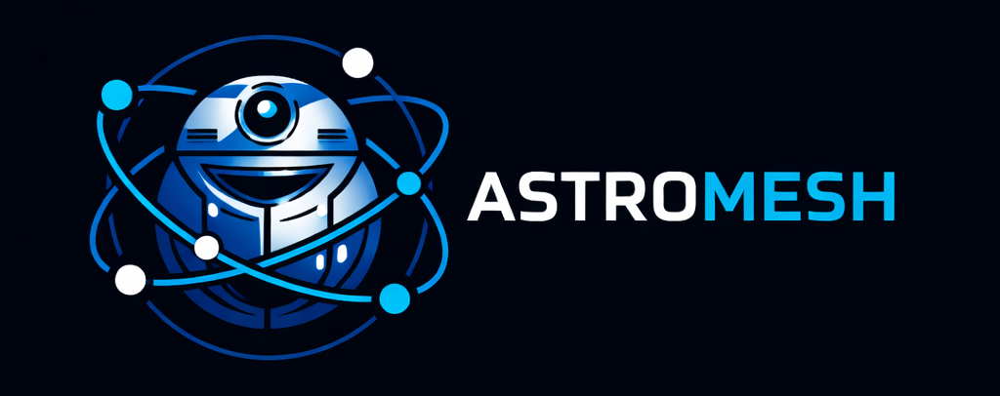

# Astromesh
### Agent Runtime Platform for building AI agents

<p align="center">
  
</p>

<p align="center">
  <a href="https://github.com/monaccode/astromesh/actions/workflows/ci.yml"></a>
  <a href="https://github.com/monaccode/astromesh/actions/workflows/release.yml"></a>
  <a href="https://github.com/monaccode/astromesh/actions/workflows/release-pypi.yml"></a>
  <a href="https://github.com/monaccode/astromesh/actions/workflows/release-adk.yml"></a>
  <a href="https://github.com/monaccode/astromesh/actions/workflows/docs.yml"></a>
  <a href="https://github.com/monaccode/astromesh/releases/latest"></a>
  <a href="https://pypi.org/project/astromesh/"></a>
  <a href="https://test.pypi.org/project/astromesh/"></a>
  <a href="https://pypi.org/project/astromesh-adk/"></a>
  <a href="https://test.pypi.org/project/astromesh-adk/"></a>
  <a href="https://github.com/monaccode/astromesh/blob/develop/LICENSE"></a>
  <a href="https://www.python.org/"></a>
</p>

<p align="center">
  <a href="https://monaccode.github.io/astromesh/"><strong>Documentation</strong></a> · <a href="https://monaccode.github.io/astromesh/getting-started/quickstart/">Quick Start</a> · <a href="https://github.com/monaccode/astromesh/releases">Releases</a>
</p>

---

> Build, orchestrate and run AI agents with multi-model routing, tools, memory, and RAG — all configured declaratively.

Astromesh is an open-source runtime for agentic systems, designed to standardize how AI agents execute, reason, and interact with external systems.

**Think of it as Kubernetes for AI Agents.**

> ⭐ If you find this project useful, consider starring the repository.

---

## Why Astromesh

Most AI applications repeatedly rebuild the same infrastructure:

- model orchestration
- tool execution
- memory systems
- RAG pipelines
- agent reasoning loops
- observability
- cost control

Astromesh centralizes these capabilities into a single runtime platform.

Instead of writing orchestration logic yourself, you define agents declaratively and let the runtime manage execution.

---

## Documentation

**Full documentation site: [monaccode.github.io/astromesh](https://monaccode.github.io/astromesh/)**

Includes getting started guides, architecture deep-dives, 7 deployment modes, configuration reference, and API docs.

Additional references in this repo:

- **Tech overview**: [`docs/TECH_OVERVIEW.md`](docs/TECH_OVERVIEW.md)
- **General architecture**: [`docs/GENERAL_ARCHITECTURE.md`](docs/GENERAL_ARCHITECTURE.md)
- **Kubernetes-style architecture diagrams**: [`docs/K8S_ARCHITECTURE.md`](docs/K8S_ARCHITECTURE.md)
- **Configuration guide**: [`docs/CONFIGURATION_GUIDE.md`](docs/CONFIGURATION_GUIDE.md)
- **WhatsApp integration**: [`docs/WHATSAPP_INTEGRATION.md`](docs/WHATSAPP_INTEGRATION.md)
- **Maia mesh guide**: [`docs/MAIA_GUIDE.md`](docs/MAIA_GUIDE.md)
- **Developer quick start**: [`docs/DEV_QUICKSTART.md`](docs/DEV_QUICKSTART.md)
- **ADK quick start**: [`docs/ADK_QUICKSTART.md`](docs/ADK_QUICKSTART.md)
- **ADK implementation status and pending work**: [`docs/ADK_PENDING.md`](docs/ADK_PENDING.md)
- **Installation (APT)**: [`docs/INSTALLATION.md`](docs/INSTALLATION.md)
- **Developer tools**: [`docs/DEVELOPER_TOOLS.md`](docs/DEVELOPER_TOOLS.md)

---

## Key Features

### Multi-Model Runtime

Run agents across multiple LLM providers:

- Ollama
- OpenAI-compatible APIs
- vLLM
- llama.cpp
- HuggingFace TGI
- ONNX Runtime

The built-in **Model Router** automatically selects the best model using strategies such as:

- cost optimized
- latency optimized
- quality first
- round robin
- capability match

---

### Multiple Agent Reasoning Patterns

Astromesh includes several orchestration strategies:

| Pattern | Description |
|---|---|
| ReAct | reasoning + tool usage loop |
| Plan & Execute | generate plan then execute |
| Pipeline | sequential processing |
| Parallel Fan-Out | multi-model collaboration |
| Supervisor | hierarchical agents |
| Swarm | distributed agent collaboration |

---

### Built-in Memory System

Agents can maintain multiple memory layers:

| Memory Type | Purpose |
|---|---|
| Conversational | chat history |
| Semantic | vector embeddings |
| Episodic | event logs |

Supported backends:

- Redis
- PostgreSQL
- SQLite
- pgvector
- ChromaDB
- Qdrant
- FAISS

---

### Retrieval-Augmented Generation (RAG)

Astromesh includes a complete RAG pipeline:

- document chunking
- embeddings
- vector search
- reranking
- context injection

Supported vector stores:

- pgvector
- ChromaDB
- Qdrant
- FAISS

---

### Tool System

Agents interact with external systems using tools:

| Type | Description |
|------|-------------|
| **Built-in** (18 tools) | web_search, http_request, sql_query, send_email, read_file, and more |
| **MCP Servers** (3) | code_interpreter, shell_exec, generate_image |
| **Agent tools** | Invoke other agents as tools for multi-agent composition |
| **Webhooks** | Call external HTTP endpoints |
| **RAG** | Query and ingest documents |

Tools are configured declaratively in agent YAML with zero-code setup for built-ins.

---

### Messaging Channels

Astromesh supports external messaging integrations.

**Current integration:**
- WhatsApp (Meta Cloud API)

**Future integrations:**
- Slack
- Telegram
- Discord
- Web chat
- Voice assistants

---

### Observability

Full observability stack with zero configuration:

- **Structured tracing** — span trees for every agent execution
- **Metrics** — counters and histograms (runs, tokens, cost, latency)
- **Built-in dashboard** — web UI at `/v1/dashboard/`
- **CLI access** — `astromeshctl traces`, `astromeshctl metrics`, `astromeshctl cost`
- **OpenTelemetry export** — compatible with Jaeger, Grafana Tempo, etc.
- **VS Code integration** — traces panel and metrics dashboard in your editor

---

### Developer Experience

Astromesh provides a complete developer toolkit:

| Tool | Description |
|------|-------------|
| **CLI** (`astromeshctl`) | Scaffold agents, run workflows, inspect traces, view metrics, validate configs |
| **Copilot** | Built-in AI assistant that helps build and debug agents |
| **VS Code Extension** | YAML IntelliSense, workflow visualizer, traces panel, metrics dashboard, copilot chat |
| **Built-in Dashboard** | Web UI at `/v1/dashboard/` with real-time observability |

```bash
# Scaffold a new agent
astromeshctl new agent customer-support

# Run it
astromeshctl run customer-support "How do I reset my password?"

# See what happened
astromeshctl traces customer-support --last 5

# Check costs
astromeshctl cost --window 24h

# Ask the copilot for help
astromeshctl ask "Why is my agent slow?"
```

---

## Architecture

Astromesh follows a layered architecture (see also [`docs/GENERAL_ARCHITECTURE.md`](docs/GENERAL_ARCHITECTURE.md) for the full reference):

```
API Layer
REST / WebSocket
        ↓
Runtime Engine
Agent lifecycle and execution
        ↓
Core Services
Model Router · Memory Manager · Tool Registry · Guardrails
        ↓
Infrastructure
LLM Providers · Vector Databases · Observability · Storage Backends
```

---

## Quick Start

### Requirements

- Python 3.12+
- uv package manager

### Install uv

```bash
pip install uv
```

### Clone the repository

```bash
git clone https://github.com/monaccode/astromesh.git
cd astromesh
```

### Install dependencies

```bash
uv sync
```

### Run the runtime

```bash
uv run uvicorn astromesh.api.main:app --reload
```

API will be available at `http://localhost:8000`

---

## Create Your First Agent

Create the file: `config/agents/my-agent.agent.yaml`

```yaml
apiVersion: astromesh/v1
kind: Agent

metadata:
  name: my-agent

spec:
  identity:
    display_name: "My Agent"

  model:
    primary:
      provider: ollama
      model: "llama3.1:8b"

  prompts:
    system: |
      You are a helpful assistant.

  orchestration:
    pattern: react
```

### Run the Agent

```bash
curl -X POST http://localhost:8000/v1/agents/my-agent/run \
  -H "Content-Type: application/json" \
  -d '{"query":"Hello","session_id":"demo"}'
```

---

## Example Use Cases

### AI Copilots
- developer assistants
- support agents
- internal knowledge assistants

### Autonomous Workflows
- document processing
- business automation
- API orchestration

### Multi-Agent Systems
- distributed reasoning
- hierarchical agents
- collaborative agents

### AI APIs
Expose agents as programmable services.

---

## Docker Deployment

Astromesh includes a full development stack:

```bash
docker compose up
```

Includes:

- Agent runtime API
- Ollama inference
- vLLM inference
- embeddings service
- PostgreSQL + pgvector
- Redis
- Prometheus
- Grafana

---

## Project Structure

```
astromesh/
 ├── api
 ├── runtime
 ├── core
 ├── providers
 ├── orchestration
 ├── memory
 ├── rag
 ├── channels
 └── observability
```

Configuration:

```
config/
 ├── agents/
 ├── rag/
 ├── providers.yaml
 └── runtime.yaml
```

---

## Optional: Rust Native Extensions

Astromesh includes optional Rust-powered native extensions for CPU-bound hot paths (chunking, PII redaction, token counting, routing). When compiled, they provide 5-50x speedup. Without them, the system falls back to pure Python automatically.

```bash
pip install maturin
maturin develop --release
```

See [`docs/NATIVE_ESTENSIONS_RUST.md`](docs/NATIVE_ESTENSIONS_RUST.md) for details.

---

## Roadmap

- [x] Multi-model runtime with 6 providers
- [x] 6 orchestration patterns (ReAct, Plan&Execute, Pipeline, Fan-Out, Supervisor, Swarm)
- [x] Memory system (conversational, semantic, episodic)
- [x] RAG pipeline with 4 vector stores
- [x] 18 built-in tools + 3 MCP servers
- [x] Full observability (tracing, metrics, dashboard)
- [x] CLI with copilot
- [x] Multi-agent composition (agent-as-tool)
- [x] Workflow YAML engine
- [x] VS Code extension
- [ ] Distributed agent execution
- [ ] GPU-aware model scheduling
- [ ] Event-driven agents
- [ ] Multi-tenant runtime
- [ ] Agent marketplace

---

## Contributing

Contributions are welcome.

Ways to contribute:

- new providers
- orchestration patterns
- vector stores
- tools
- bug fixes
- documentation improvements

---

## License

Apache-2.0 (see `LICENSE`)

---

## Community

Community resources coming soon:

- Discord
- Roadmap discussions
- Contributor guide

---

> ⭐ If you like Astromesh, give the repo a star. It helps the project reach more developers.