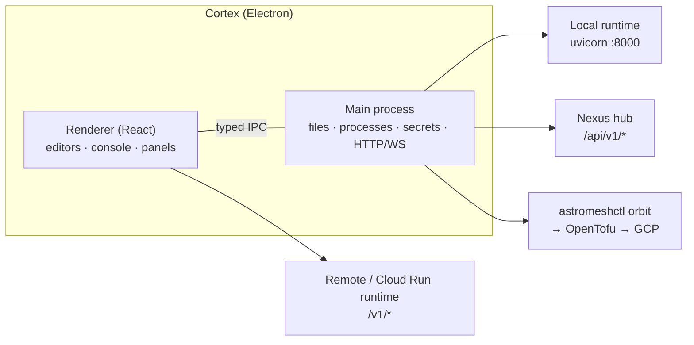

import { Aside } from '@astrojs/starlight/components';

**Astromesh Cortex** is a desktop application for building and operating Astromesh agents. You
write an agent in a schema-aware YAML editor or a visual builder, run it in a console that
shows every tool call and every model's cost, and ship it to the runtime you want: one that
Cortex installs on your machine, one it provisions on Google Cloud, or a
[Nexus](/astromesh/nexus/introduction/) hub.

<Aside type="note">
**v0.21.0.** Electron 41, React 19. Agent schema at parity with astromesh core 0.59, plus the
`via` field of core 0.61. Lives in its own repository,
[monaccode/astromesh-cortex](https://github.com/monaccode/astromesh-cortex). There is no
installer yet: Cortex runs from source (see the [Quick Start](/astromesh/cortex/quickstart/)).
</Aside>

## Two modes

A Cortex window works in one of two modes, switched from the status bar or with `Ctrl+M`.

| Mode | Talks to | What you do there |
|---|---|---|
| **Runtime** | An Astromesh runtime: local, remote, or a Cloud Run service | Author agents, RAG pipelines and workflows; run and trace them; install the local runtime; provision GCP; wire WhatsApp |
| **Nexus** | A Nexus hub | Publish and version agents per tenant, run them, read consumption, manage API keys, browse the catalog, and (as an operator) manage tariffs and plans |

Both modes share the editor area. A tab that belongs to the other mode stays open but
disabled until you switch back.

## What Cortex does

| Area | What you get |
|---|---|
| **Workspaces** | A project is a folder with `.cortex/workspace.json`: connections, environments and UI state, committed with your code |
| **YAML editor** | Monaco with validation, completion and hover against the agent, RAG pipeline and workflow schemas; context-aware snippets and a section helper |
| **Visual builder** | A canvas with one block per spec section, and inspectors for models with per-role routing, all six tool types, prefetch, knowledge and the Glyph program |
| **Console** | Live runs over WebSocket: each tool call and its verdict, the model's reasoning, writes proposed but not executed, cached tokens, per-model cost, chain links, and the full trace |
| **RAG and workflows** | A visual builder for RAG pipelines; a workflow editor, run tracking and the human-in-the-loop approval queue |
| **Local runtime** | A one-click install of the runtime with its own Python, plus start, stop, update and health |
| **GCP** | A four-step wizard that provisions a Cloud Run runtime through [Orbit](/astromesh/orbit/introduction/), and then logs, status, redeploy, an infrastructure map and destroy |
| **Nexus** | Publish, version, compare and revert agents, run them with streaming and cancel, consumption by month, agent and invocation, the hub's catalog, and the operator's tariffs and plans |
| **Channels** | A WhatsApp setup wizard, live channel traffic, and an ngrok or cloudflared tunnel for local webhooks |
| **Terminal** | An `astromeshctl`-style command line over the active runtime's API |

## Architecture

- **The renderer** draws everything and calls the runtime API (`/v1/*`) directly for the
  active runtime connection.
- **The main process** does everything privileged: workspace files, installing and running the
  local runtime, running Orbit, downloading tunnel binaries, every Nexus call (including the
  run stream, whose handshake needs auth headers), and secrets kept with the operating
  system's encryption (`safeStorage`).

## Cortex, Forge and Leia

| | [Forge](/astromesh/forge/introduction/) | Cortex | [Leia](/astromesh/leia/introduction/) |
|---|---|---|---|
| Form | Web app inside a runtime node | Desktop app | Claude Code plugin |
| Reaches | That node | Any runtime, GCP, any Nexus hub | Runtimes and Nexus, by conversation |
| Best for | A quick edit on a running node | Building, debugging and operating across environments | Doing the same in natural language |

Agents created by any of them, or by the ADK or the CLI, appear in Cortex's Agents panel,
because they all live in the same runtime API.

## Next steps

- [Quick Start](/astromesh/cortex/quickstart/) — from source to a running agent
- [Workspaces & Layout](/astromesh/cortex/workspaces/) — the project file, environments, shortcuts
- [Authoring Agents](/astromesh/cortex/authoring/) — YAML editor, visual builder, tools, RAG, workflows
- [Console & Traces](/astromesh/cortex/console/) — running and debugging
- [Runtimes & GCP](/astromesh/cortex/runtimes/) — the local runtime and Cloud Run
- [Nexus Mode](/astromesh/cortex/nexus/) — operating agents on a hub
- [Channels](/astromesh/cortex/channels/) — WhatsApp, channel activity and the dev tunnel
