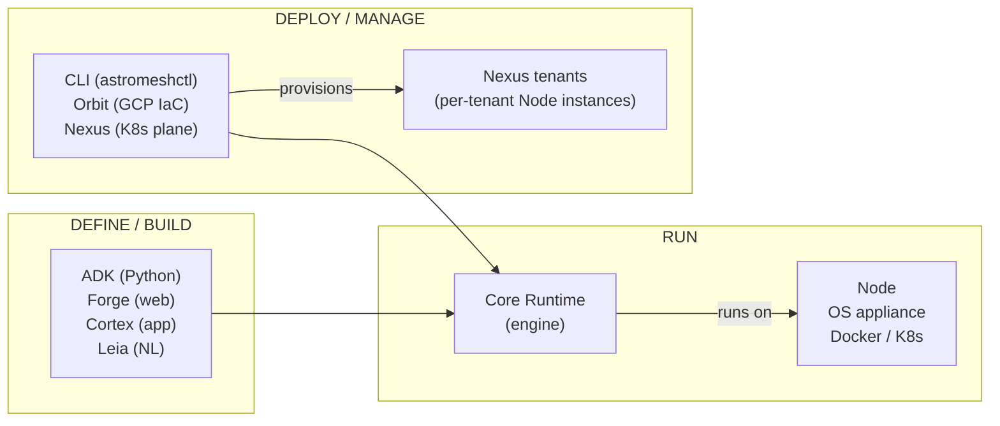
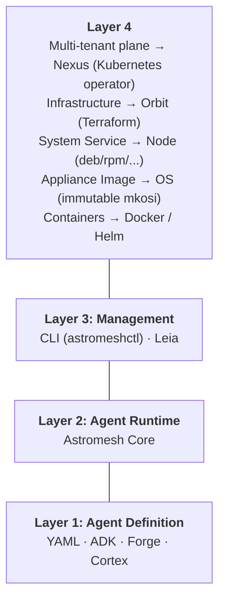

Astromesh is not a single tool — it's an **ecosystem** designed to cover the full lifecycle of AI agents: **define, build, run, deploy, and manage**. The core runtime is the foundation, and a set of satellite projects extend it for specific use cases.

You can use just the core runtime with YAML config files, or combine it with the ADK for Python-first development, Forge or Cortex for visual building, the CLI and Node for system-level operation, OS for a hardened appliance, Orbit and Nexus for cloud, or Leia for a natural-language workflow.

## Components at a Glance

| Component | What it does | Package / Repo | Version |
|-----------|-------------|----------------|---------|
| **Core Runtime** | Multi-model agent engine with 6 orchestration patterns, per-role model routing, memory, tools, and guardrails | `astromesh` | v0.35.0 |
| **ADK** | Python-first agent SDK with decorators, CLI, and hot reload | `astromesh-adk` | v0.2.0 |
| **CLI** | Standalone CLI for managing nodes and clusters | `astromesh-cli` | v0.1.1 |
| **Node** | Cross-platform system installer and daemon (Linux, macOS, Windows) | `astromesh-node` | v0.1.1 |
| **OS** | Minimal, immutable, API-only Linux *appliance* that runs agents | [`astromesh-os`](https://github.com/monaccode/astromesh-os) | v0.4.0 (Phase 4) |
| **Forge** | Visual agent builder — a web SPA embedded in a node at `/forge` | `astromesh-forge` | v0.24.0 |
| **Cortex** | Desktop IDE & multi-runtime control plane (Electron) | `astromesh-cortex` | v0.12.0 |
| **Orbit** | Cloud-native IaC deployment — generates Terraform for GCP (AWS/Azure planned) | `astromesh-orbit` | v0.4.0 |
| **Nexus** | Multi-tenant Kubernetes control plane (operator + REST API) | `astromesh-nexus` | v0.3.0 |
| **Leia** | Natural-language agent operations as a Claude Code plugin | `astromesh-leia` | v0.1.0 |
| **Nebula** | Open-model foundry — trains, gates, and publishes the ecosystem's own models | [`astromesh-nebula`](https://github.com/monaccode/astromesh-nebula) | v0.1.0 (preview) |

## How They Relate

Every component orbits the **Core Runtime** — the engine that loads agents, routes to LLM providers, and executes orchestration patterns. The satellites attach at different points in the lifecycle:

- **ADK** builds agents in Python → generates YAML the **Core Runtime** understands.
- **Forge** and **Cortex** build agents visually (see [Forge vs Cortex](#forge-vs-cortex) below).
- **Leia** drives the whole flow in plain English from inside Claude Code.
- **Core Runtime** is the engine that executes agents.
- **Node** installs the runtime as a native system service (`astromeshd`); **OS** ships it as a sealed appliance image; **Docker/Helm** package it for containers.
- **CLI** is the `astromeshctl` management interface.
- **Orbit** provisions cloud infrastructure with Terraform; **Nexus** is the multi-tenant control plane that runs a Node per tenant in Kubernetes.
- **[Nebula](/astromesh/nebula/introduction/)** sits *upstream* of the runtime: it's the open-model foundry that trains, gates, and publishes the ecosystem's own models (the [Models](/astromesh/models/) catalog the runtime routes to).

## Forge vs Cortex

Both build agents visually, but they are **distinct, coexisting products** with different form factors — pick by where and how you work.

| | **Forge** | **Cortex** |
|---|---|---|
| Form factor | Web SPA (Vite + React) | Desktop app (Electron) |
| Where it runs | Embedded in a node at `/forge`, or `npx astromesh-forge` | Installed locally as a native IDE |
| Backend | None — pure client against one node's `/v1/*` API | Manages local runtime, GCP (Orbit), and Nexus connections |
| Scope | Quick visual building & a developer console for one node | Full IDE + multi-runtime control plane and ops console |
| Best for | Fast, zero-install agent building inside a running node | Day-to-day development, testing, channels, and deployment |

In short: reach for **Forge** when you want an instant, in-node visual builder; reach for **[Cortex](/astromesh/cortex/introduction/)** when you want a full desktop IDE that also provisions and operates runtimes. Forge's heavier monitoring/ops concerns are handled by Cortex.

## When to Use What

| I want to... | Use... |
|-------------|--------|
| Define agents with YAML and run the runtime directly | [**Astromesh Core**](/astromesh/getting-started/quickstart/) |
| Define agents with Python decorators and a CLI | [**Astromesh ADK**](/astromesh/adk/introduction/) |
| Build agents visually in the browser, embedded in a node | [**Astromesh Forge**](/astromesh/forge/introduction/) |
| Design, test, and deploy from a desktop IDE | [**Astromesh Cortex**](/astromesh/cortex/introduction/) |
| Go from idea to a deployed WhatsApp agent in plain English | [**Astromesh Leia**](/astromesh/leia/introduction/) |
| Install as a system service on Linux, macOS, or Windows | [**Astromesh Node**](/astromesh/node/introduction/) |
| Run agents on a hardened, immutable appliance | [**Astromesh OS**](/astromesh/os/introduction/) |
| Deploy in containers or Kubernetes | [**Docker / Helm**](/astromesh/deployment/docker-single/) (part of core) |
| Provision cloud infrastructure with Terraform | [**Astromesh Orbit**](/astromesh/orbit/introduction/) |
| Run a multi-tenant agent platform on Kubernetes | [**Astromesh Nexus**](/astromesh/nexus/introduction/) |
| Manage nodes and clusters from the command line | [**Astromesh CLI**](/astromesh/reference/cli-commands/) |
| Train and publish the ecosystem's own open models | [**Astromesh Nebula**](/astromesh/nebula/introduction/) |

## Deployment Layers

The ecosystem forms a layered stack. You choose your entry point at each layer:

**Layer 1** is where you define agents — YAML files, ADK Python decorators, or the Forge/Cortex visual builders. All produce the same agent definitions.

**Layer 2** is the runtime engine that loads agents, connects to LLM providers, manages memory, and executes orchestration patterns (ReAct, PlanAndExecute, etc.).

**Layer 3** is the management layer — `astromeshctl` controls running nodes and clusters; Leia drives them in natural language.

**Layer 4** is how you deploy the runtime. Pick the one that fits your infrastructure: Node for bare-metal/VM, OS for a sealed appliance, Docker for containers, Helm for Kubernetes, Orbit for cloud-managed infrastructure, or Nexus for a multi-tenant platform.

## Next Steps

| Component | Start here |
|-----------|-----------|
| Core Runtime | [Quick Start](/astromesh/getting-started/quickstart/) — run your first agent in 5 minutes |
| ADK | [ADK Introduction](/astromesh/adk/introduction/) — Python-first agent development |
| Forge | [Forge Introduction](/astromesh/forge/introduction/) — visual agent builder |
| Cortex | [Cortex Introduction](/astromesh/cortex/introduction/) — desktop IDE & control plane |
| Leia | [Leia Introduction](/astromesh/leia/introduction/) — agents in plain English |
| Node | [Node Introduction](/astromesh/node/introduction/) — install as a system service |
| OS | [OS Introduction](/astromesh/os/introduction/) — the immutable agent appliance |
| Orbit | [Orbit Introduction](/astromesh/orbit/introduction/) — provision cloud infrastructure |
| Nexus | [Nexus Introduction](/astromesh/nexus/introduction/) — multi-tenant Kubernetes control plane |
| Nebula | [Nebula Introduction](/astromesh/nebula/introduction/) — the open-model foundry where our models are born |
