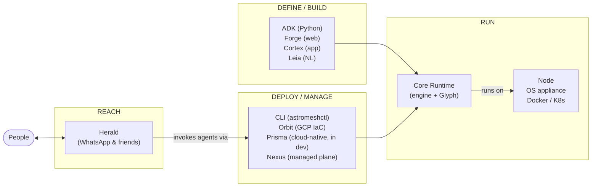
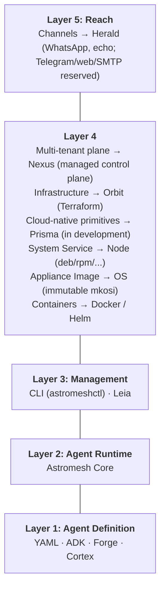

Astromesh is not a single tool — it's an **ecosystem** designed to cover the full lifecycle of AI agents: **define, build, run, deploy, and manage**. The core runtime is the foundation, and a set of satellite projects extend it for specific use cases.

You can use just the core runtime with YAML config files, or combine it with the ADK for Python-first development, Forge or Cortex for visual building, the CLI and Node for system-level operation, OS for a hardened appliance, Orbit and Nexus for cloud, Herald to reach people on WhatsApp, or Leia for a natural-language workflow.

Nothing here ships on the same clock. Each package carries its own version and its own changelog; a core release does not bump anything else, and a component that has not changed keeps its number.

## Components at a Glance

| Component | What it does | Package / Repo | Version |
|-----------|-------------|----------------|---------|
| **Core Runtime** | Multi-model agent engine with 7 orchestration patterns, per-role model routing, declarative agent chaining, memory, tools, and guardrails | `astromesh` | v0.40.0 |
| **Glyph** | Action language — an agent's plan as a program the runtime executes, instead of a tool-calling loop | `astromesh-glyph` | v0.1.0 |
| **ADK** | Python-first agent SDK with decorators, CLI, and hot reload | `astromesh-adk` | v0.2.0 |
| **CLI** | Standalone CLI for managing nodes and clusters | `astromesh-cli` | v0.2.0 |
| **Node** | Cross-platform system installer and daemon (Linux, macOS, Windows) | `astromesh-node` | v0.1.1 |
| **OS** | Minimal, immutable, API-only Linux *appliance* that runs agents | [`astromesh-os`](https://github.com/monaccode/astromesh-os) | v0.10.1 (Phase 4 + post-4) |
| **Forge** | Visual agent builder — a web SPA embedded in a node at `/forge` | `astromesh-forge` | v0.24.0 |
| **Cortex** | Desktop IDE & multi-runtime control plane (Electron) | `astromesh-cortex` | v0.19.0 |
| **Orbit** | Cloud-native IaC deployment — generates Terraform for GCP (AWS/Azure planned) | `astromesh-orbit` | v0.4.0 |
| **Prisma** | Multi-cloud reconciler — translates the same agent spec into a cloud's own managed AI primitives | [`astromesh-prisma`](https://github.com/monaccode/astromesh-prisma) | *in development* |
| **Nexus** | Multi-tenant managed control plane — publishes, runs, meters and bills agents | `astromesh-nexus` | v0.11.0 |
| **Herald** | Communications gateway — channel messages reach agents, and agents reach people back | [`astromesh-herald`](https://github.com/monaccode/astromesh-herald) | v0.1.0 |
| **Leia** | Natural-language agent operations as a Claude Code plugin | `astromesh-leia` | v0.5.0 |
| **Nebula** | Open-model foundry — trains, gates, and publishes the ecosystem's own models | [`astromesh-nebula`](https://github.com/monaccode/astromesh-nebula) | v0.1.0 (preview) |

## How They Relate

Every component orbits the **Core Runtime** — the engine that loads agents, routes to LLM providers, and executes orchestration patterns. The satellites attach at different points in the lifecycle:

```mermaid
flowchart LR
    subgraph build["DEFINE / BUILD"]
        tools["`ADK (Python)
        Forge (web)
        Cortex (app)
        Leia (NL)`"]
    end
    subgraph run["RUN"]
        core["`Core Runtime
        (engine + Glyph)`"]
        infra["`Node
        OS appliance
        Docker / K8s`"]
    end
    subgraph manage["DEPLOY / MANAGE"]
        mgmt["`CLI (astromeshctl)
        Orbit (GCP IaC)
        Prisma (cloud-native, in dev)
        Nexus (managed plane)`"]
    end
    subgraph reach["REACH"]
        herald["`Herald
        (WhatsApp & friends)`"]
    end
    people(["People"])
    tools --> core
    mgmt --> core
    core -- runs on --> infra
    people <--> herald
    herald -- "invokes agents via" --> mgmt
```

- **ADK** builds agents in Python → generates YAML the **Core Runtime** understands.
- **Forge** and **Cortex** build agents visually (see [Forge vs Cortex](#forge-vs-cortex) below).
- **Leia** drives the whole flow in plain English from inside Claude Code.
- **Core Runtime** is the engine that executes agents.
- **Node** installs the runtime as a native system service (`astromeshd`); **OS** ships it as a sealed appliance image; **Docker/Helm** package it for containers.
- **CLI** is the `astromeshctl` management interface.
- **Orbit** provisions cloud infrastructure with Terraform; **Nexus** is the multi-tenant managed control plane — it keeps agent specs in PostgreSQL with versioning and dispatches runs to a shared runtime pool, metering and billing what each one consumes.
- **[Herald](/astromesh/herald/introduction/)** sits *in front* of Nexus: an inbound WhatsApp message invokes an agent, and an agent can reach a person back through the same outbox. It never talks to the runtime — whether an agent exists and who may run it is Nexus's call.
- **[Glyph](/astromesh/glyph/introduction/)** sits *inside* the runtime: it is an orchestration pattern where the plan is a program rather than a loop. Reach for it when an agent chains five or more tools every time; not when it needs to see the data before deciding what to do next.
- **[Prisma](/astromesh/prisma/introduction/)** is the other answer to "put this on a cloud": where Orbit provisions infrastructure *you* operate the runtime on, Prisma hands the workload to the cloud's own managed AI service and writes down what that service cannot host. It is in development — nothing to install yet.
- **[Nebula](/astromesh/nebula/introduction/)** sits *upstream* of the runtime: it's the open-model foundry that trains, gates, and publishes the ecosystem's own models (the [Models](/astromesh/models/) catalog the runtime routes to).

## Forge vs Cortex

Both build agents visually, but they are **distinct, coexisting products** with different form factors — pick by where and how you work.

| | **Forge** | **Cortex** |
|---|---|---|
| Form factor | Web SPA (Vite + React) | Desktop app (Electron) |
| Where it runs | Embedded in a node at `/forge`, or `npx astromesh-forge` | Installed locally as a native IDE |
| Backend | None — pure client against one node's `/v1/*` API | Manages local runtime, GCP (Orbit), and Nexus connections |
| Scope | Quick visual building & a developer console for one node | Full IDE + multi-runtime control plane and ops console |
| Best for | Fast, zero-install agent building inside a running node | Day-to-day development, testing, channels, and deployment |

In short: reach for **Forge** when you want an instant, in-node visual builder; reach for **[Cortex](/astromesh/cortex/introduction/)** when you want a full desktop IDE that also provisions and operates runtimes. Forge's heavier monitoring/ops concerns are handled by Cortex.

## When to Use What

| I want to... | Use... |
|-------------|--------|
| Define agents with YAML and run the runtime directly | [**Astromesh Core**](/astromesh/getting-started/quickstart/) |
| Define agents with Python decorators and a CLI | [**Astromesh ADK**](/astromesh/adk/introduction/) |
| Build agents visually in the browser, embedded in a node | [**Astromesh Forge**](/astromesh/forge/introduction/) |
| Design, test, and deploy from a desktop IDE | [**Astromesh Cortex**](/astromesh/cortex/introduction/) |
| Go from idea to a deployed WhatsApp agent in plain English | [**Astromesh Leia**](/astromesh/leia/introduction/) |
| Install as a system service on Linux, macOS, or Windows | [**Astromesh Node**](/astromesh/node/introduction/) |
| Run agents on a hardened, immutable appliance | [**Astromesh OS**](/astromesh/os/introduction/) |
| Deploy in containers or Kubernetes | [**Docker / Helm**](/astromesh/deployment/docker-single/) (part of core) |
| Provision cloud infrastructure with Terraform | [**Astromesh Orbit**](/astromesh/orbit/introduction/) |
| Run a multi-tenant agent platform on Kubernetes | [**Astromesh Nexus**](/astromesh/nexus/introduction/) |
| Put an agent on WhatsApp, and let it message people back | [**Astromesh Herald**](/astromesh/herald/introduction/) |
| Replace a long tool-calling loop with one reviewed program | [**Glyph**](/astromesh/glyph/introduction/) |
| Manage nodes and clusters from the command line | [**Astromesh CLI**](/astromesh/reference/cli-commands/) |
| Hand the workload to a cloud's own managed AI service | [**Astromesh Prisma**](/astromesh/prisma/introduction/) *(in development)* |
| Train and publish the ecosystem's own open models | [**Astromesh Nebula**](/astromesh/nebula/introduction/) |

## Deployment Layers

The ecosystem forms a layered stack. You choose your entry point at each layer:

```mermaid
flowchart TB
    l5["`**Layer 5: Reach**
    Channels → Herald (WhatsApp, echo; Telegram/web/SMTP reserved)`"]
    l4["`**Layer 4**
    Multi-tenant plane → Nexus (managed control plane)
    Infrastructure → Orbit (Terraform)
    Cloud-native primitives → Prisma (in development)
    System Service → Node (deb/rpm/...)
    Appliance Image → OS (immutable mkosi)
    Containers → Docker / Helm`"]
    l3["`**Layer 3: Management**
    CLI (astromeshctl) · Leia`"]
    l2["`**Layer 2: Agent Runtime**
    Astromesh Core`"]
    l1["`**Layer 1: Agent Definition**
    YAML · ADK · Forge · Cortex`"]
    l5 --- l4 --- l3 --- l2 --- l1
```

**Layer 1** is where you define agents — YAML files, ADK Python decorators, or the Forge/Cortex visual builders. All produce the same agent definitions.

**Layer 2** is the runtime engine that loads agents, connects to LLM providers, manages memory, and executes orchestration patterns (ReAct, PlanAndExecute, etc.).

**Layer 3** is the management layer — `astromeshctl` controls running nodes and clusters; Leia drives them in natural language.

**Layer 4** is how you deploy the runtime. Pick the one that fits your infrastructure: Node for bare-metal/VM, OS for a sealed appliance, Docker for containers, Helm for Kubernetes, Orbit for cloud-managed infrastructure, or Nexus for a multi-tenant platform. Prisma is the one exception on this layer: it does not deploy the runtime at all, it hands the workload to a cloud's own managed AI service — and it is still in development.

**Layer 5** is how people reach the agents and the agents reach back. Herald owns the channel credentials and the delivery queue; it invokes agents through Nexus and never touches the runtime.

## Next Steps

| Component | Start here |
|-----------|-----------|
| Core Runtime | [Quick Start](/astromesh/getting-started/quickstart/) — run your first agent in 5 minutes |
| ADK | [ADK Introduction](/astromesh/adk/introduction/) — Python-first agent development |
| Forge | [Forge Introduction](/astromesh/forge/introduction/) — visual agent builder |
| Cortex | [Cortex Introduction](/astromesh/cortex/introduction/) — desktop IDE & control plane |
| Leia | [Leia Introduction](/astromesh/leia/introduction/) — agents in plain English |
| Node | [Node Introduction](/astromesh/node/introduction/) — install as a system service |
| OS | [OS Introduction](/astromesh/os/introduction/) — the immutable agent appliance |
| Orbit | [Orbit Introduction](/astromesh/orbit/introduction/) — provision cloud infrastructure |
| Nexus | [Nexus Introduction](/astromesh/nexus/introduction/) — multi-tenant Kubernetes control plane |
| Prisma | [Prisma Introduction](/astromesh/prisma/introduction/) — the multi-cloud reconciler, and what it does not do yet |
| Herald | [Herald Introduction](/astromesh/herald/introduction/) — channels in, proactive messages out |
| Glyph | [Glyph Introduction](/astromesh/glyph/introduction/) — the action language, and when it actually pays |
| Nebula | [Nebula Introduction](/astromesh/nebula/introduction/) — the open-model foundry where our models are born |
