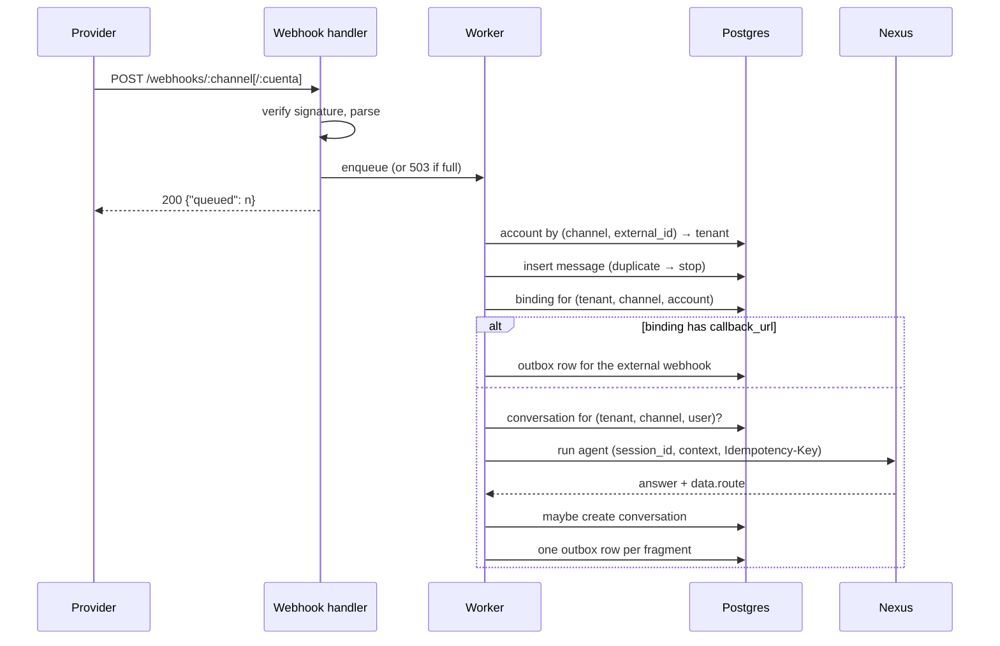
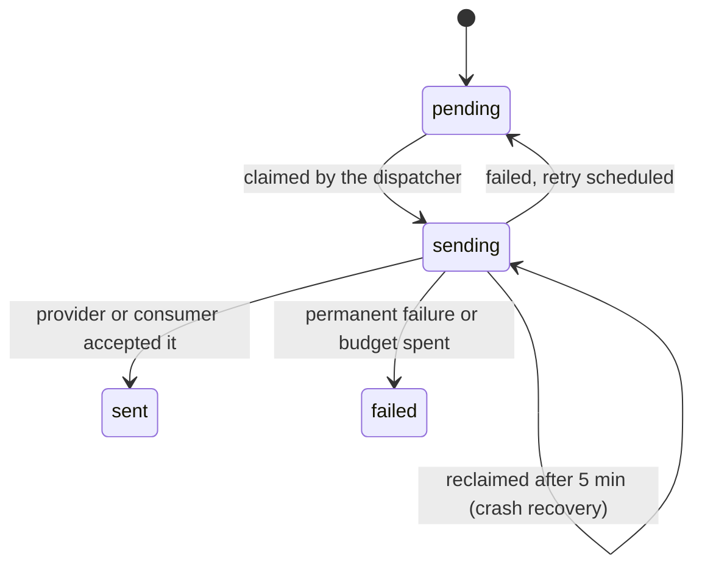

import { Aside } from '@astrojs/starlight/components';

Herald is one Go binary over one PostgreSQL database. It runs two loops side by side: a pool
of workers that processes inbound messages, and a dispatcher that drains the outbox. Nothing
else is stateful. The emulators keep their record in memory, and that record is lost on a
restart.

## Components

| Component | Detail |
|---|---|
| HTTP server | Gin on `:8081`: webhooks, send API, identity lookup, operator plane, console |
| Inbound queue | Bounded buffer of 256 messages, 10 workers. A full buffer answers `503` so the provider retries |
| Receive service | Account → tenant → identity → dedupe → binding → agent run or forward → outbox |
| Dispatch worker | Polls the outbox every 500 ms, claims up to 20 due rows, delivers through the channel adapter |
| Nexus client | `POST /api/v1/agents/:name/run` with the binding's Nexus API key |
| Webhook client | Signed POSTs for bindings that forward instead of running an agent |
| Store | Plain SQL over pgx. Migrations are embedded and run at boot |
| Console | React + Vite, built into the binary with `go:embed`, served at `/ui/` |

The code is hexagonal. Interfaces are declared by whoever uses them:

```
cmd/herald/            composition root: flags, adapters, manual wiring
pkg/heraldclient/      public Go client of the send API (stdlib only)
internal/
  domain/              Message, Conversation, Binding, OutboxEntry, RouteDecision, backoff
  ports/               ChannelAdapter and its optional extensions, AgentClient, stores
  app/                 receive, send, dispatch, fragments
  adapters/
    channel/           whatsapp, telegram, instagram, webchat, echo, emulador, smtp (unwired)
    agentclient/nexus/ the /run client
    webhookclient/     the signed forwarder
    store/postgres/    SQL, migrations, AES-GCM sealing of credentials
  server/              Gin handlers and middleware
  webui/               the embedded console
```

A channel adapter implements five methods: `Name`, `VerifyRequest`, `ParseIncoming`,
`SendText` and `SendMedia`. Anything a single provider needs is an optional interface that
the core detects by type assertion:

| Optional interface | Who implements it | What it adds |
|---|---|---|
| `ChallengeVerifier` | WhatsApp, Instagram | Meta's `hub.challenge` subscription handshake |
| `SignatureHeaderNamer` | Telegram | Which header carries the signature (Meta's is the default) |
| `WebhookRegistrar` | Telegram | Tell the provider where to deliver, when an account is created |
| `TemplateSender` | WhatsApp | Pre-approved templates for messages outside the 24-hour window |
| `MediaDownloader` | WhatsApp, Telegram, Instagram | Fetch the bytes of an inbound attachment |

Adding Instagram touched a new package, the channel constant, the wiring and the manifests.
It did not touch the webhook handler, the dispatcher or the ports.

## The inbound pipeline



Step by step:

1. **Verify and parse.** The adapter checks the signature: Meta's `X-Hub-Signature-256` for
   WhatsApp and Instagram, the `X-Telegram-Bot-Api-Secret-Token` header for Telegram. A bad
   signature is `401`. A payload the adapter cannot parse is `400`, not a silent `200`,
   because it means Herald and the provider disagree on the wire format.
2. **Acknowledge.** Each parsed message goes onto the inbound queue and the handler answers
   `200`. If the queue is full, the answer is `503` with how many were queued, so the
   provider retries. Duplicates absorb the retry later.
3. **Resolve the account.** `(channel, external_id)` finds the channel account, and the
   account gives the tenant. Telegram cannot name the bot inside the payload, so its webhook
   URL carries it: `/webhooks/telegram/<bot id>`. The handler only fills that value in when
   the parser left it empty.
4. **Store the identity.** On Telegram, a contact the person shared about themselves is
   saved as a verified phone for `(tenant, channel, user)`.
5. **Deduplicate.** The message is inserted before anything else, so it survives any later
   failure. The unique key is `(channel, account_id, channel_message_id)`. Telegram restarts
   message ids at 1 for every bot, so the account has to be part of the key. A duplicate
   ends the work with no error.
6. **Find the binding.** A binding is the routing rule for one account. If its config has a
   `callback_url`, the message is queued for the external webhook and Nexus is never called
   (see [Webhook Forwarding](/astromesh/herald/forwarding/)).
7. **Route.** If a conversation exists for `(tenant, channel, user)`, its agent and its
   `session_id` are used. Otherwise the binding's entry agent runs with
   `session_id = <channel>__<user>`.
8. **Run the agent** through Nexus. See below.
9. **Open the conversation** if the agent's `data.route` says so. See
   [routing decisions](#routing-decisions).
10. **Queue the answer**, one outbox row per fragment.

### The run call

| Aspect | Value |
|---|---|
| Endpoint | `POST {NEXUS_URL}/api/v1/agents/:name/run` |
| Credential | `X-API-Key` from the binding's `config.nexus_api_key` |
| Body | `query`, `session_id`, `context` (see [Building Agents](/astromesh/herald/agents/)) |
| Idempotency | `Idempotency-Key: <channel>:<account_id>:<channel_message_id>` |
| Timeout | `--agent-run-timeout`, 120 s by default. It bounds the whole agent turn, tool calls included |
| Retries | Up to two more attempts on a `5xx`. A client timeout is not retried |

Nexus records an invocation before it dispatches it. A retry after a `5xx` therefore always
lands on Nexus's idempotency replay, which answers `200` with the stored row and no answer.
Herald reads the row's `status` to tell the cases apart:

| Answer | `status` | Herald concludes |
|---|---|---|
| Present | any | The run produced an answer: queue it |
| Empty | `ok` | The first delivery already replied. Log a warning, send nothing |
| Empty | `in_progress` | The original call is still running and will reply. Send nothing |
| Empty | anything else, or unknown | The run failed: send the fallback |

### When the run fails

Every run failure sends the binding's `fallback_message`, if it has one, as an ordinary
outbox reply. That includes a `404` or `403` from Nexus, a `5xx`, a timeout, an unreachable
Nexus and a closed run with no answer. The fallback is for the person; the error is still
logged for the operator.

One failure is repaired instead of reported. A conversation keeps the agent it was handed
to, and CLARUS puts the deployment id in agent names, so replacing a deployment can leave old
conversations pointing at an agent that no longer exists. When a conversation's agent answers
`404` and it is not the entry agent, Herald retries with the binding's entry agent and
repoints the conversation to it.

<Aside type="caution">
A Herald that cannot reach Nexus still accepts every webhook and answers each one with the
fallback message. From the outside that looks like an agent problem. Check `NEXUS_URL`
first; in Kubernetes it must be the cross-namespace service name.
</Aside>

### Routing decisions

When a conversation is new, the entry agent decides what happens to it through `data.route`
in its response:

| `data.route` | Result |
|---|---|
| Absent | Open the conversation, owned by the entry agent |
| `{"start_session": true}` | Open the conversation, owned by the entry agent |
| `{"start_session": true, "handoff_agent": "billing"}` | Open the conversation, owned by `billing` |
| `{"start_session": false}` | Open nothing. The answer is still delivered |

A conversation has no expiry. Once opened, every later message from that person on that
channel goes to its agent under the same `session_id`, until the conversation's agent stops
existing (see above).

## The outbox

Every outgoing message is a row in `outbox`, and every row goes through the same states.



| Property | Behaviour |
|---|---|
| Claim | One `UPDATE … WHERE id IN (SELECT … FOR UPDATE SKIP LOCKED)`, so replicas split the work |
| Order | By `created_at` |
| Poll | Every 500 ms (`--outbox-poll-interval`), up to 20 rows per pass |
| Backoff | `30 s × 2ⁿ⁻¹`: 30 s, 1 min, 2 min, 4 min… |
| Budget | 10 attempts, about 8.5 hours in total |
| Permanent at once | The adapter does not support the payload (a template on a channel without them), the account no longer exists, or a forward lost its callback config |
| Crash recovery | A row stuck in `sending` for 5 minutes is claimed again |
| Guarantee | At least once |

A row's `source` says what produced it: `agent_reply`, `nexus_proactive` or
`inbound_forward`. A send API `202` means the row was queued. Its real outcome is in
`GET /api/v1/messages/:id`.

### Fragments

If an agent's answer contains `[[+]]`, each part becomes its own row. Parts are trimmed,
empty ones are dropped, and anything after the fifth part is joined into the fifth. Row *i*
is due 1.5 s × *i* after the first, and its `created_at` is offset by *i* milliseconds so
that the order holds.

The pause lives in `next_retry_at`, so it costs no goroutine and survives a restart. It only
works because the poll interval (500 ms) is shorter than the pause (1.5 s): each pass claims
everything already due, so a longer poll would send two fragments back to back. If a middle
fragment fails, its retry comes 30 s later, after the fragments behind it have already gone.
That trade-off was accepted knowingly.

### What goes out

| Payload | Delivery |
|---|---|
| `template` | Through `TemplateSender` (WhatsApp only); anywhere else it fails permanently |
| `media` | The **first** attachment only, sent by public URL. Extra attachments are logged and dropped |
| `text` | `SendText`. On Telegram, with the contact button when the binding asks for it and no phone is verified yet |

## Data model

Six migrations, applied in order at boot.

| Table | Holds | Key constraints |
|---|---|---|
| `channel_accounts` | One tenant's credentials for one channel line, sealed with AES-GCM; `emulated` flag | Unique `(tenant_id, channel, external_id)`; a webchat slug is unique across tenants |
| `bindings` | Routing rule per account: `entry_agent`, `fallback_message`, `config` JSONB | Unique `(tenant_id, channel, account_id)`; deleted with its account |
| `conversations` | Who owns an ongoing conversation: `session_id`, `agent_name`, `last_message_at` | Unique `(tenant_id, channel, external_user)` and unique `session_id` |
| `messages` | Every inbound message with its raw payload | Unique `(channel, account_id, channel_message_id)` |
| `outbox` | Every outgoing message and its delivery state | Partial index on due rows; partial index on sent rows for web chat threads |
| `channel_identities` | Verified phone per `(tenant, channel, external_user)` | Primary key on the triple |

Channel credentials are sealed with AES-GCM under a key derived (SHA-256) from
`HERALD_ENC_KEY`. They are only plaintext in memory, and every API response masks them as
`•••` plus the last four characters. There is no re-encryption path, so the encryption key
is created once and never rotated.

## Security model

- **Missing credential, missing route.** No admin token means no `/admin`. No send keys
  means no send API. No trusted sender key means no `send-on-behalf` and no identity lookup.
  A channel without its secrets has no webhook. A misconfigured deployment exposes nothing
  rather than something half-protected.
- **Three separate planes.** A tenant key (`X-Herald-Key`), the trusted sender key
  (`X-Herald-Sender-Key`) and the admin token (`X-Admin-Token`) each guard their own route
  group. None of them works on another plane.
- **Constant-time comparisons** for every key, without an early exit on the tenant key map.
- **Weak secrets stop the boot.** An admin token or trusted sender key shorter than 32
  bytes is a startup error. One WhatsApp or Instagram secret without its pair is too.
- **Masked secrets cannot round-trip.** Writing back a value that starts with `•••` is
  rejected, so a read-modify-write against a masked response cannot overwrite a real secret.

## Next steps

- [Building Agents for Herald](/astromesh/herald/agents/) — the agent's side of the run call
- [API Reference](/astromesh/herald/api-reference/) — every route
- [Operations](/astromesh/herald/operations/) — flags, console and deploy
