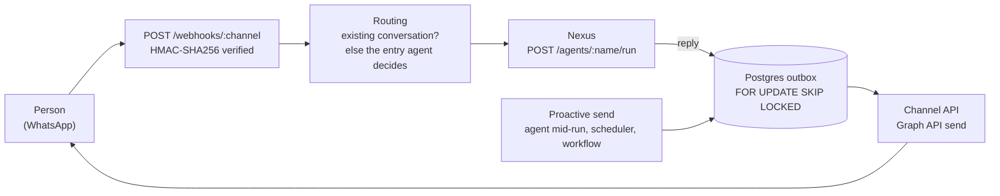

import { Aside } from '@astrojs/starlight/components';

**Astromesh Herald** connects messaging channels — WhatsApp today, Telegram, web chat and
email reserved — to agents running behind [Astromesh Nexus](/astromesh/nexus/introduction/).
It carries traffic in both directions:

- **Herald → Nexus.** An inbound channel message invokes an agent through
  `POST /api/v1/agents/:name/run`, with an `Idempotency-Key` and a stable `session_id` per
  channel conversation.
- **Nexus → Herald.** Nexus — and therefore agents — send proactive messages through Herald's
  own REST API, delivered asynchronously through the same outbox pipeline as agent replies.

<Aside type="note">
**v0.1.0 · first release.** Go 1.25, Gin, pgx/v5, PostgreSQL. Lives in its own repository:
[monaccode/astromesh-herald](https://github.com/monaccode/astromesh-herald).
</Aside>

## What Herald is not

Herald **never talks to the Astromesh runtime**, and it never decides on its own whether an
agent exists or who may run it. That is Nexus's call, checked when a binding is created and
again on every run. Herald holds channel credentials and conversation state; it holds no
opinion about agents.

It is also not a WhatsApp SDK. WhatsApp is one adapter behind a channel port, and the
provider's policies — the 24-hour window, template approval — are deliberately kept inside
that adapter rather than pushed into the core contract.

## The path a message takes



Replies and proactive sends share one queue on purpose. There is a single delivery path to
reason about, a single retry budget, and a single place to look when a message did not arrive.

## Inbound routing, two ways

When a message arrives, Herald asks one question first: does a conversation already exist for
`(tenant, channel, external_user)`?

**It does.** The message goes to that conversation's agent, under its existing `session_id`.
Nothing else is decided.

**It does not.** The binding's **entry agent** gets the message and decides, answering with a
documented convention in `data.route`:

```json
{
  "answer": "Te ayudo con tu reclamo.",
  "data": {
    "route": { "start_session": true, "handoff_agent": "reclamos" }
  }
}
```

| `data.route` | What Herald does |
|---|---|
| `start_session: true` | Persists the conversation, owned by `handoff_agent` if given, else the entry agent |
| `start_session: false` | Persists nothing — the agent's answer (a courtesy refusal, say) is still delivered |
| absent | Defaults to starting the session with the entry agent |

This is what keeps a wrong-number message from costing a conversation row and a session that
lives forever. The agent that greets is allowed to decide that there is nothing to greet.

## The outbox

Every outgoing message — an agent's reply, a proactive send, an operator's test — is a row in
one Postgres outbox, drained by a polling worker.

| Property | Behaviour |
|---|---|
| Claiming | `FOR UPDATE SKIP LOCKED`, so N replicas can drain the same queue safely |
| Backoff | Exponential, `30s × 2ⁿ` |
| Give-up | After 10 attempts |
| Guarantee | At-least-once |
| Poll interval | 2s (`--outbox-poll-interval`) |

Because delivery is asynchronous, a `202` from the send API means **queued**, not delivered.
Poll `GET /api/v1/messages/:id` for the real status.

## Channels

| Channel | State | Notes |
|---|---|---|
| **WhatsApp** | Live | Meta Cloud API: `hub.challenge` handshake, `X-Hub-Signature-256` verification, text/image/audio/video/document parsing, Graph API sends, template sends, media download |
| **Echo** | Development | The whole pipeline with no provider account. Unauthenticated, so it only registers behind `--enable-echo` |
| **Telegram** | Reserved | Full `ports.ChannelAdapter` implementation returning `ErrNotImplemented` |
| **Web chat** | Reserved | Reserves the channel; needs a WebSocket endpoint to activate |
| **SMTP** | Reserved | Outbound only, by design |

A reserved channel is a real port implementation that refuses work. The contract exists; the
provider integration does not. See [WhatsApp setup](/astromesh/herald/whatsapp/) for the only
one you can put in front of customers today.

## Architecture

Hexagonal — ports and adapters — with interfaces defined by their consumers, not their
implementations.

```
cmd/herald/            composition root: manual wiring, flags with env defaults
pkg/heraldclient/      public Go client of the send API (stdlib only — Nexus imports this)
internal/
  domain/              Message, Conversation, Binding, RouteDecision, OutboxEntry + backoff
  ports/               ChannelAdapter, AgentClient, segregated stores, use cases
  app/                 receive (two-way routing), send, dispatch worker
  adapters/
    channel/whatsapp/  Meta Cloud API
    channel/echo/      development channel, behind --enable-echo
    channel/telegram/  stub
    channel/webchat/   stub
    channel/smtp/      stub, outbound-only by design
    agentclient/nexus/ HTTP client: /run, X-API-Key, Idempotency-Key, 30s, 5xx retry
    store/postgres/    plain SQL over pgx, JSONB, AES-GCM-encrypted credentials
  crypto/              AES-GCM sealing of channel-account secrets (HERALD_ENC_KEY)
  server/              Gin: /webhooks/:channel, /api/v1/messages/*, /admin/*, /ui/*
  webui/               go:embed tree of the built operator console
```

**Absent credential, absent route.** Every credential is optional and its absence unregisters
its surface: no `--admin-token` means no `/admin`, no `--send-keys` means no send API, no
WhatsApp pair means `/webhooks/whatsapp` is a 404. A misconfigured deployment does not expose
a half-authenticated endpoint — it exposes nothing.

## The operator console

Herald embeds a React console in the binary (`go:embed`), served at `/ui/`. The static files
carry no data: every number comes from the token-guarded `/admin` API, so signing in is
pasting the admin token. Disable it with `--ui=false`.

Five screens: an overview (active conversations, outbox state, messages per day and per
channel), a conversation list with its message thread, an outbox monitor showing how much of
each entry's 10-attempt budget is spent, plus routing-rule and channel-account CRUD. The
operator test send lives on the outbox screen, because that is where its result shows up.

Channel-account credentials are AES-GCM sealed at rest and masked (`•••` + last 4) in every
response, including the ones the console reads.

## How agents reach people

An agent can now start a conversation instead of only answering one. The
[`send_message`](/astromesh/reference/core/builtin-tools/) builtin tool, shipped in astromesh
**v0.40.0**, goes out through Nexus (`POST /api/v1/runs/messages/send`), which queues in
Herald's outbox and answers with an id.

The credential is the interesting part. The runtime pool is shared between tenants, so giving
it per-tenant secrets would gather every tenant's key into one process. Instead Nexus mints a
token **per invocation**, valid for one tenant, one capability and one run, and drops it into
the run context as `_nexus_run_token`. It dies with the run. There is nothing to rotate.

<Aside type="caution">
Herald's own README still describes this tool as blocked. It was, until the per-run credential
landed in Nexus **v0.11.0** and astromesh **v0.40.0**. The mechanism above is the current one.
</Aside>

## Next steps

- [Quick Start](/astromesh/herald/quickstart/) — the whole pipeline running locally, no provider account
- [WhatsApp Setup](/astromesh/herald/whatsapp/) — Meta Cloud API, the 24-hour window, templates
- [API Reference](/astromesh/herald/api-reference/) — send API, operator plane, `heraldclient`, every flag
