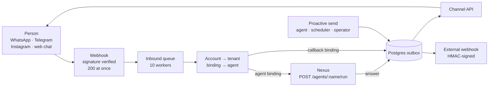
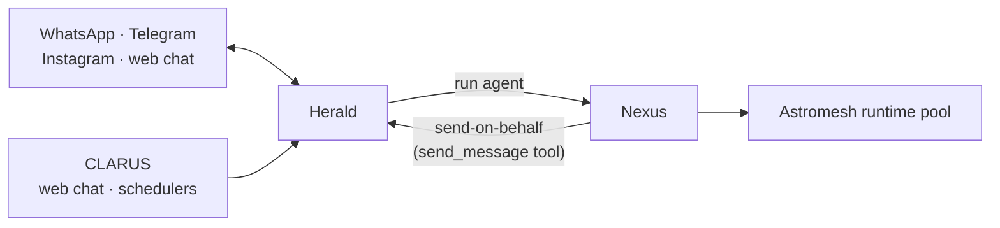

import { Aside } from '@astrojs/starlight/components';

**Astromesh Herald** connects messaging channels to agents running behind
[Astromesh Nexus](/astromesh/nexus/introduction/). A person writes on WhatsApp, Telegram,
Instagram or a web chat. Herald works out which tenant and which agent the message belongs to,
runs that agent through Nexus, and delivers the answer on the same channel.

It carries traffic in both directions:

- **Channel → agent.** An inbound message runs an agent through Nexus
  (`POST /api/v1/agents/:name/run`), with a stable `session_id` per conversation and an
  `Idempotency-Key` per message.
- **Agent → channel.** An agent, a scheduler or an operator queues a message through Herald's
  send API. It leaves through the same outbox as every agent reply.

<Aside type="note">
**v0.11.0.** Go 1.25, Gin, pgx/v5, PostgreSQL 17. Lives in its own repository,
[monaccode/astromesh-herald](https://github.com/monaccode/astromesh-herald), and is released
from `main` (the `mvp` tag) with an immutable `:X.Y.Z` image per version.
</Aside>

## What Herald does

| Area | What it gives you |
|---|---|
| **Four live channels** | WhatsApp (Meta Cloud API), Telegram (Bot API), Instagram (Messaging API) and web chat, plus an `echo` channel for development. |
| **Routing** | The first message of a conversation goes to the binding's **entry agent**, which can hand the conversation to another agent or decline to open one. Later messages go straight to the agent that owns the conversation. |
| **One outbox** | Agent replies, proactive sends and webhook forwards are all rows in one Postgres table, retried with exponential backoff and claimed with `FOR UPDATE SKIP LOCKED`. |
| **Answers in several messages** | An agent that writes `[[+]]` between parts gets each part delivered as its own message, with a pause between them. |
| **Never silence** | A failed agent run sends the binding's fallback message. A photo, an audio or a shared contact without text still reaches the agent as a short description. |
| **Proactive sends** | Text, one media attachment by URL, or a WhatsApp template, queued per tenant or on behalf of any tenant. Agents use it through the `send_message` tool. |
| **Channel identity** | On Telegram a person can share their own phone number with one tap; Herald stores it as a verified identity and passes it to the agent. |
| **Webhook forwarding** | A binding can skip Nexus and POST every inbound message, media included, to an external HTTPS endpoint signed with HMAC-SHA256. |
| **Emulators** | WhatsApp and Instagram lines can be emulated, so a whole product flow runs end to end without a Meta account. |
| **Operator console** | A React console embedded in the binary: overview, conversations, outbox, routing rules and channel accounts. |

## The path a message takes

```mermaid
flowchart LR
    person["Person<br/>WhatsApp · Telegram<br/>Instagram · web chat"]
    hook["Webhook<br/>signature verified<br/>200 at once"]
    queue["Inbound queue<br/>10 workers"]
    route["Account → tenant<br/>binding → agent"]
    nexus["Nexus<br/>POST /agents/:name/run"]
    outbox[("Postgres outbox")]
    send["Channel API"]
    ext["External webhook<br/>HMAC-signed"]

    person --> hook --> queue --> route
    route -- "agent binding" --> nexus -- "answer" --> outbox
    route -- "callback binding" --> outbox
    outbox --> send --> person
    outbox --> ext
    proactive["Proactive send<br/>agent · scheduler · operator"] --> outbox
```

The webhook answers `200` before the agent runs, because Meta's delivery timeout is shorter
than an LLM call. Everything after that happens in a worker pool. Every outgoing message,
whatever produced it, is a row in one outbox: one delivery path, one retry budget, and one
place to look when a message did not arrive.

## Channels

| Channel | Status | How the account is identified | Notes |
|---|---|---|---|
| [**WhatsApp**](/astromesh/herald/whatsapp/) | Live | `phone_number_id` in the payload | Templates for cold contacts, 24-hour window, emulator |
| [**Telegram**](/astromesh/herald/telegram/) | Live | Bot id in the webhook URL | Herald registers the webhook itself; contact-sharing button; quoted replies reach the agent |
| [**Instagram**](/astromesh/herald/instagram/) | Live; real traffic needs Meta App Review | Instagram account id in the payload | No templates, so no cold contacts; emulator |
| [**Web chat**](/astromesh/herald/webchat/) | Live, opt-in | Slug minted by CLARUS | CLARUS fronts the browser; Herald stores the thread |
| **Echo** | Development | `account_id` in the payload | No authentication at all, so it only exists behind `--enable-echo` |
| SMTP | Not registered | — | A package with the port's shape; it is not wired into the binary |

A channel without its credentials is not registered: its webhook is a `404`, and a send queued
for it never reaches a provider.

## What Herald is not

- **It does not decide about agents.** Whether an agent exists and who may run it is Nexus's
  call, checked when a binding is written and again on every run. Herald holds channel
  credentials and conversation state.
- **It never talks to the Astromesh runtime.** Agents run behind Nexus. Herald only knows the
  Nexus API.
- **It does not store files.** Media goes out by public URL and comes in as a provider
  reference. A forward downloads it right before delivery and passes it along as base64.
- **It is not a provider SDK.** Each provider's rules — Meta's 24-hour window, Telegram's
  per-bot webhook — live inside that channel's adapter, not in the core contract.

## Where it fits

```mermaid
flowchart LR
    channels["WhatsApp · Telegram<br/>Instagram · web chat"] <--> herald["Herald"]
    clarus["CLARUS<br/>web chat · schedulers"] --> herald
    herald -- "run agent" --> nexus["Nexus"]
    nexus -- "send-on-behalf<br/>(send_message tool)" --> herald
    nexus --> pool["Astromesh runtime pool"]
```

- **[Nexus](/astromesh/nexus/introduction/)** runs the agents Herald routes to, and calls
  Herald back when an agent uses the `send_message` tool.
- **[The Astromesh runtime](/astromesh/reference/core/builtin-tools/)** provides the
  `send_message` builtin tool that agents use to reach a person mid-run.
- **CLARUS** publishes web chat links, runs schedulers that send on behalf of tenants, and
  resolves verified identities.

## Next steps

- [Architecture](/astromesh/herald/architecture/) — the inbound pipeline, the outbox and the data model
- [Quick Start](/astromesh/herald/quickstart/) — the whole pipeline locally, no provider account
- [Building Agents for Herald](/astromesh/herald/agents/) — what the agent receives and how it answers
- [API Reference](/astromesh/herald/api-reference/) — every route
- [Operations](/astromesh/herald/operations/) — configuration, console, deploy
