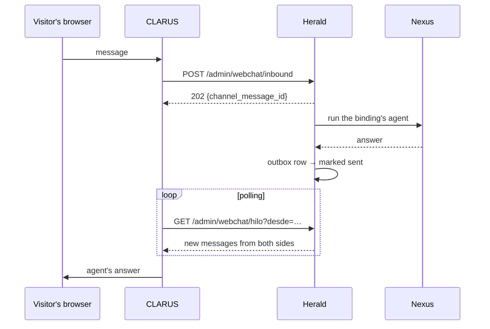

import { Aside } from '@astrojs/starlight/components';

Web chat is the one channel without a provider. **CLARUS** serves the chat page and talks to
the visitor's browser. Herald never opens a WebSocket to anyone. CLARUS reaches the channel
through two operator routes: one pushes a visitor's message in, the other reads the thread
back.



From the moment a message is pushed in, it follows the normal pipeline: account, binding,
conversation, agent, outbox. Delivery is the only special part. Sending on web chat does
nothing and succeeds, so the outbox row is marked `sent`, and that row is what the thread
read returns. Herald keeps no sessions in memory, so a restart loses nothing.

## Setup

1. Start Herald with `--enable-webchat` (`HERALD_ENABLE_WEBCHAT=true`). It is off by default,
   because its routes run agents on behalf of anonymous visitors.
2. Create a channel account for each chat link. The `external_id` is the slug CLARUS
   minted for the link; web chat needs no credentials.

   ```sh
   curl -X POST localhost:8081/admin/accounts \
     -H "X-Admin-Token: $HERALD_ADMIN_TOKEN" -H "Content-Type: application/json" \
     -d '{"tenant_id":"tenant-1","channel":"webchat","external_id":"mi-tienda","credentials":{}}'
   ```

   A slug belongs to one tenant only. A second tenant registering the same slug is
   rejected, since an inbound message is resolved by slug alone.
3. Bind the account to an entry agent, as on any other channel.

## Pushing a message in

```sh
curl -X POST localhost:8081/admin/webchat/inbound \
  -H "X-Admin-Token: $HERALD_ADMIN_TOKEN" -H "Content-Type: application/json" \
  -d '{"cuenta":"mi-tienda","visitante":"v-3f9a","texto":"¿Tienen envío a Córdoba?"}'
# → 202 {"encolado": true, "channel_message_id": "webchat-…"}
```

| Field | Content |
|---|---|
| `cuenta` | The account's slug |
| `visitante` | A stable id for the visitor, chosen by CLARUS. It becomes `sender` and the conversation key |
| `texto` | The message |

All three are required. An unknown slug is `404` immediately, and a full inbound queue is
`503`.

## Reading the thread

```sh
curl "localhost:8081/admin/webchat/hilo?cuenta=mi-tienda&visitante=v-3f9a&desde=2026-09-20T14:03:11.123456Z" \
  -H "X-Admin-Token: $HERALD_ADMIN_TOKEN"
```

```json
{
  "mensajes": [
    { "id": "…", "lado": "visitante", "texto": "¿Tienen envío a Córdoba?", "media": [], "at": "…" },
    { "id": "…", "lado": "agente", "texto": "¡Sí! Enviamos a todo el país.", "media": [], "at": "…" }
  ]
}
```

The thread merges the visitor's messages with the agent's **sent** outbox rows, in the order
each became visible, up to 200 per call. `desde` is optional and exclusive: pass the `at` of
the last message you have, in RFC 3339 with nanoseconds, to get only what came after it.

The agent's side is ordered by when each row was sent, not when it was queued. An answer
split with `[[+]]` is queued all at once but sent one part at a time, so ordering by queue
time would put every part at the same instant.

<Aside type="caution">
Registering the web chat adapter also opens the generic `POST /webhooks/webchat`, which
checks no signature because there is no provider to sign anything. Its parser rejects every
request on purpose, and a test fails if that ever changes. The only way in is the
admin-protected `/admin/webchat/inbound`.
</Aside>
