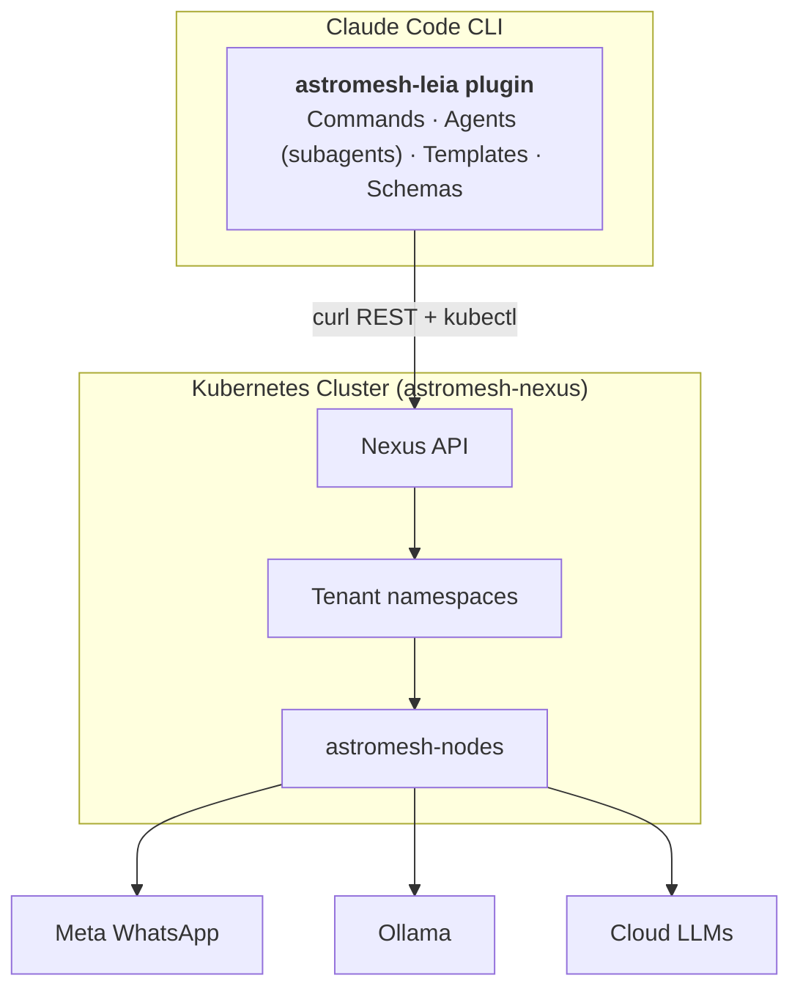

import { Aside } from '@astrojs/starlight/components';

<Aside type="caution">
**v0.1.0 · Claude Code plugin.** Leia is pre-1.0 and targets Nexus `0.3.x`. Commands and template schemas may change between minor releases.
</Aside>

**Astromesh Leia** is a [Claude Code](https://claude.com/claude-code) plugin that gives you a natural-language interface — `/leia ...` slash commands — for creating, deploying, and managing AI agents on [astromesh-nexus](/astromesh/nexus/introduction/) Kubernetes clusters. The goal is simple: go from a business idea to a deployed WhatsApp agent in minutes, with no Kubernetes expertise required.

Leia is named after a lemon beagle — approachable, loyal, and friendly. That personality carries into the plugin: you describe what you need in plain English, and Leia handles the cluster work behind the scenes.

## What Leia Is

- A **Claude Code plugin** you install once and drive through `/leia` slash commands.
- A **conversational CLI**: describe what you want in natural language, or use explicit subcommands.
- An **orchestrator** that designs agent manifests, talks to the Nexus REST API over `curl`, and runs `kubectl` for cluster operations.
- A **batteries-included starter kit** with business-vertical templates, specialized subagents, and bundled `astromesh/v1` schemas.

## What Leia Is NOT

- It is **not a SaaS** — it runs locally inside your Claude Code CLI.
- It is **not a no-code GUI** — it is a conversational command-line plugin.
- It is **not an agent framework** — the agents it builds *run on* [Nexus](/astromesh/nexus/introduction/) and its per-tenant nodes, not inside Leia.

## Architecture

Leia lives inside Claude Code and drives a Nexus cluster. Its components — commands, subagents, templates, and schemas — turn your intent into manifests and API calls; Nexus fans those agents out to per-tenant `astromesh-nodes`, which connect to WhatsApp and to local or cloud language models.

### Component breakdown

| Layer | What it does |
|-------|--------------|
| **Commands** | The 10 `/leia ...` slash commands — your entry points for create, deploy, status, logs, test, and cluster lifecycle. |
| **Agents (subagents)** | 5 specialized subagents (interpreter, architect, operator, tester, doctor) that natural language routes to. |
| **Templates** | 6 complete `astromesh/v1` business-vertical agent manifests you can deploy as-is or customize. |
| **Schemas** | Bundled references — the `astromesh/v1` agent spec (including **per-role models** on core `0.29.0+`: assign a different model/source per orchestration role such as `planner`/`worker`/`synthesizer`), orchestration patterns, WhatsApp config, and the Nexus API. |
| **Nexus API** | The control plane Leia calls over REST + `kubectl` to provision tenants and sync agents. |
| **astromesh-nodes** | The per-tenant runtimes where agents actually execute and connect to WhatsApp, Ollama, and cloud LLMs. |

## Ecosystem Role

Leia is the human-friendly front door to [Nexus](/astromesh/nexus/introduction/). You drive Leia; Leia drives Nexus; Nexus runs your agents on per-tenant nodes. See the [ecosystem overview](/astromesh/getting-started/ecosystem/) for how Leia, Nexus, and the nodes fit together.

## What's Next

- [Quickstart](/astromesh/leia/quickstart/) — install Leia and ship your first agent.
- [Commands](/astromesh/leia/commands/) — the full `/leia` command reference.
- [Templates & Subagents](/astromesh/leia/templates/) — the business templates and the agents that build them.
- [Nexus introduction](/astromesh/nexus/introduction/) — the cluster Leia deploys to.
