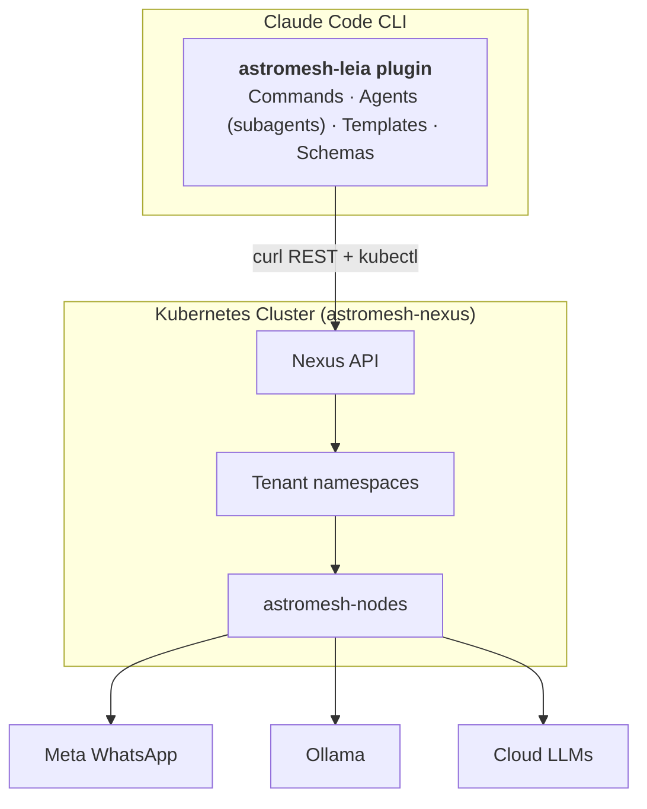

import { Aside } from '@astrojs/starlight/components';

<Aside type="caution">
**v0.4.0 · Claude Code plugin.** Leia is pre-1.0 and targets Nexus `0.3.x` with astromesh core `0.29`–`0.36.x`. Commands and template schemas may change between minor releases.
</Aside>

**Astromesh Leia** is a [Claude Code](https://claude.com/claude-code) plugin that gives you a natural-language interface — `/leia ...` slash commands — for creating, deploying, and managing AI agents on [astromesh-nexus](/astromesh/nexus/introduction/) Kubernetes clusters. The goal is simple: go from a business idea to a deployed WhatsApp agent in minutes, with no Kubernetes expertise required.

Leia is named after a lemon beagle — approachable, loyal, and friendly. That personality carries into the plugin: you describe what you need in plain English, and Leia handles the cluster work behind the scenes.

## What Leia Is

- A **Claude Code plugin** you install once and drive through `/leia` slash commands.
- A **conversational CLI**: describe what you want in natural language, or use explicit subcommands.
- An **orchestrator** that designs agent manifests, talks to the Nexus REST API over `curl`, and runs `kubectl` for cluster operations.
- A **batteries-included starter kit** with business-vertical templates, specialized subagents, and bundled `astromesh/v1` schemas.

## What Leia Is NOT

- It is **not a SaaS** — it runs locally inside your Claude Code CLI.
- It is **not a no-code GUI** — it is a conversational command-line plugin.
- It is **not an agent framework** — the agents it builds *run on* [Nexus](/astromesh/nexus/introduction/) and the Astromesh runtime, not inside Leia.

## What's new

Leia's value is the *knowledge* it carries: the architect subagent can only emit manifests as correct as the schemas bundled with the plugin. Each release syncs that knowledge to a newer core.

### v0.4.0 — synced to core v0.36.0

The largest knowledge jump so far, covering six core releases (v0.29 → v0.36):

- **Tool-type clarity.** Only `builtin`, `agent` and `client` load from agent YAML. The architect now offers `client` tools as its primary recommendation and never emits the non-loadable types (`internal`, `webhook`, `rag`, `mcp_*`) it used to suggest.
- **Model-block consumption matrix.** Which keys each source actually reads — Ollama's nested `options` and `num_predict`, `timeout` honoured on `openai_compat`, `litellm` ignoring `endpoint`. Unconsumed keys now produce a warning instead of being silently dropped.
- **Streaming contract and usage accounting.** The on-wire `tool_call`/`tool_result` protocol and `usage.by_model` for per-model cost tracking within a run.
- **Nexus API coverage.** RAG pipeline CRUD and the workflow-registration endpoint.

### v0.3.0 — per-role models

Taught the plugin the `spec.model.default` + `roles` shape, the `litellm` cloud multi-provider source, the role vocabulary each orchestration pattern requests, and `orchestration.role_map`. The architect can now bind a strong cloud planner to one role and a cheap local worker to another.

### v0.2.1 — Moonshot / Kimi

The Moonshot provider recipe via `openai_compat`, including the thinking-model behaviour and cache-aware pricing.

## Architecture

Leia lives inside Claude Code and drives a Nexus cluster. Its components — commands, subagents, templates, and schemas — turn your intent into manifests and API calls; Nexus fans those agents out to per-tenant `astromesh-nodes`, which connect to WhatsApp and to local or cloud language models.

```mermaid
flowchart TB
  subgraph cli["Claude Code CLI"]
    plugin["`**astromesh-leia plugin**
    Commands · Agents (subagents) · Templates · Schemas`"]
  end
  subgraph cluster["Kubernetes Cluster (astromesh-nexus)"]
    nexus["Nexus API"] --> tenants["Tenant namespaces"] --> nodes["astromesh-nodes"]
  end
  plugin -- "curl REST + kubectl" --> nexus
  nodes --> whatsapp["Meta WhatsApp"]
  nodes --> ollama["Ollama"]
  nodes --> cloud["Cloud LLMs"]
```

### Component breakdown

| Layer | What it does |
|-------|--------------|
| **Commands** | The 10 `/leia ...` slash commands — your entry points for create, deploy, status, logs, test, and cluster lifecycle. |
| **Agents (subagents)** | 5 specialized subagents (interpreter, architect, operator, tester, doctor) that natural language routes to. |
| **Templates** | 6 complete `astromesh/v1` business-vertical agent manifests you can deploy as-is or customize. |
| **Schemas** | Bundled references — the `astromesh/v1` agent spec (including **per-role models** on core `0.29.0+`: assign a different model/source per orchestration role such as `planner`/`worker`/`synthesizer`), orchestration patterns, WhatsApp config, and the Nexus API. |
| **Nexus API** | The control plane Leia calls over REST + `kubectl` to provision tenants and sync agents. |
| **astromesh-nodes** | The per-tenant runtimes where agents actually execute and connect to WhatsApp, Ollama, and cloud LLMs. |

## Ecosystem Role

Leia is the human-friendly front door to [Nexus](/astromesh/nexus/introduction/). You drive Leia; Leia drives Nexus; Nexus runs your agents on per-tenant nodes. See the [ecosystem overview](/astromesh/getting-started/ecosystem/) for how Leia, Nexus, and the nodes fit together.

## What's Next

- [Quickstart](/astromesh/leia/quickstart/) — install Leia and ship your first agent.
- [Commands](/astromesh/leia/commands/) — the full `/leia` command reference.
- [Templates & Subagents](/astromesh/leia/templates/) — the business templates and the agents that build them.
- [Nexus introduction](/astromesh/nexus/introduction/) — the cluster Leia deploys to.
