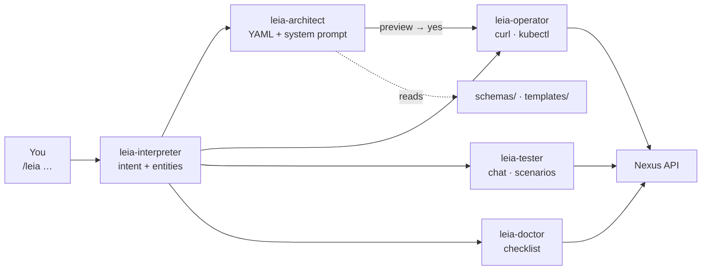

import { Aside } from '@astrojs/starlight/components';

**Astromesh Leia** is a [Claude Code](https://claude.com/claude-code) plugin. You describe the
agent you need, in English or Spanish, and Leia designs a complete `astromesh/v1` manifest with
a real system prompt, shows it to you, and can deploy it, test it and diagnose it on a
[Nexus](/astromesh/nexus/introduction/) hub. It is named after a lemon beagle.

<Aside type="caution" title="v0.5.0 targets an older Nexus">
Leia's operations (deploy, status, logs, test, bootstrap, doctor) were written for **Nexus
0.3.x**, when Nexus was a Kubernetes operator. Against the current managed Nexus (0.26.x) they
do not work as written: Leia sends the API key as `Authorization: Bearer`, and Nexus only reads
API keys from `X-API-Key`, so its API calls are refused. Its tenant checks also use resources
that no longer exist. **Agent design, templates and the schema knowledge work regardless of
Nexus.** See [Compatibility](#compatibility).
</Aside>

## What Leia is

- **Prompts, not a program.** Leia is ten slash commands, five subagents, six templates and four
  reference schemas, all Markdown and YAML. Claude Code runs them; the actual work happens
  through `curl`, `kubectl` and `ollama` on your machine.
- **An agent designer.** Its architect subagent knows the agent schema up to astromesh core
  0.38.1: per-role models, the real orchestration patterns, `spec.chain`,
  `spec.output_schema`, which tool types load, and the mistakes that make a runtime ignore a
  section without saying so.
- **A deploy-and-test loop** for a Nexus hub: publish, poll, chat with the agent, run scored
  test scenarios, and walk a diagnostic checklist when something fails.

It is not a hosted service, a GUI or an agent framework. The agents it builds run on Nexus and
the Astromesh runtime.

## How it works


```mermaid
flowchart LR
  you["You<br/>/leia …"] --> interp["leia-interpreter<br/>intent + entities"]
  interp --> arch["leia-architect<br/>YAML + system prompt"]
  interp --> op["leia-operator<br/>curl · kubectl"]
  interp --> test["leia-tester<br/>chat · scenarios"]
  interp --> doc["leia-doctor<br/>checklist"]
  arch -- "preview → yes" --> op
  op --> nexus["Nexus API"]
  test --> nexus
  doc --> nexus
  arch -. reads .-> kb["schemas/ · templates/"]
```

| Subagent | Model | Does |
|---|---|---|
| `leia-interpreter` | Sonnet | Turns a sentence into an intent (create, deploy, status, test, diagnose…) and entities (business, channel, name, tenant, vertical), then routes |
| `leia-architect` | Opus | Reads the bundled schemas and the closest template, checks `ollama list`, picks a pattern, and writes the manifest |
| `leia-operator` | Sonnet | Calls the Nexus API with `curl` and the cluster with `kubectl` |
| `leia-tester` | Sonnet | Proxies a chat to the agent, or runs five scenarios and scores them |
| `leia-doctor` | Sonnet | Walks a fixed checklist, stops at the first failure, and gives a root cause and the fix |

## Compatibility

| Part | Nexus 0.3.x (operator) | Nexus 0.26.x (managed hub) |
|---|---|---|
| `/leia create` (design, preview, write YAML) | Works | Works |
| `/leia templates` | Works | Works |
| `/leia config` | Works | Works |
| Publishing (`create` → deploy, `/leia deploy`) | Works | **Refused (`401`)**: key sent as `Bearer` |
| `/leia status`, `logs`, `test` | Works | **Refused (`401`)**; status also reads tenant CRDs |
| `/leia bootstrap local`, `teardown` | Works | **Installs the old operator**: Nexus's `hack/bootstrap.sh` still does |
| `/leia bootstrap remote` | Works | Auth check fails (`401`) |
| `leia-doctor` checks 3–8 | Works | Use `kubectl` resources that no longer exist |

Until Leia is synced with the managed hub, design with Leia and publish the YAML with
[Cortex](/astromesh/cortex/nexus/) or the [Nexus API](/astromesh/nexus/api-reference/):

```bash
curl -X POST "$NEXUS_URL/api/v1/agents" \
  -H "X-API-Key: $NEXUS_API_KEY" -H "Content-Type: application/yaml" \
  --data-binary @agents/my-agent.yaml
```

| Leia | Nexus | Astromesh core knowledge |
|---|---|---|
| 0.5.x | 0.3.x | 0.29 – 0.38.x |
| 0.4.x | 0.3.x | 0.29 – 0.36.x |
| 0.2.x | 0.3.x | 0.18 – 0.28.9 |

## What each release taught it

Leia's value is what the architect knows, so each release is a knowledge sync with a core
version.

| Version | Synced to | Added |
|---|---|---|
| **0.5.0** | core 0.38.1 | `spec.chain` and `spec.output_schema`: when to offer them, that every agent in `on_complete` must be deployed first, and that an older runtime ignores both silently. The doctor checks chain declarations |
| 0.4.0 | core 0.36.0 | Only `builtin`, `agent` and `client` tools load from YAML; which model keys each source reads; the streaming contract and `usage.by_model`; RAG pipeline and workflow endpoints |
| 0.3.0 | core 0.29.0 | Per-role models (`default` + `roles`), `litellm`, the roles each pattern asks for |
| 0.2.1 | core 0.28.9 | Moonshot / Kimi through `openai_compat` |
| 0.2.0 | core 0.28.5, Nexus 0.3.0 | Fixed templates that the runtime silently ignored (flat `memory`, `limit` instead of `max_chars`) and invalid patterns; dual auth |

<Aside type="note">
The architect's knowledge stops at core 0.38.1. It does not know the `integration`, `api` and
`mcp` tool types, `prefetch` or Glyph, which arrived later; for those, author in
[Cortex](/astromesh/cortex/authoring/).
</Aside>

## Next steps

- [Quick Start](/astromesh/leia/quickstart/) — install the plugin and design your first agent
- [Command Reference](/astromesh/leia/commands/) — every command, step by step
- [Templates & Agents](/astromesh/leia/templates/) — the templates, the subagents and the bundled schemas
