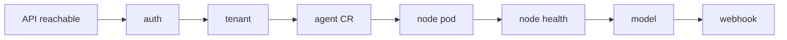

import { Aside } from '@astrojs/starlight/components';

Leia ships with everything needed to design and deploy production-shaped agents: ready-made **business templates**, the **subagents** that build and operate them, and the **schemas** they are built against.

## Business templates

Leia bundles **6 business-vertical templates**. Each is a complete `astromesh/v1` Agent manifest with a default model of Ollama `llama3.1:8b` and built-in guardrails (PII redaction plus an output `max_length`). Browse them with [`/leia templates`](/astromesh/leia/commands/#leia-templates), or use them as the starting point for [`/leia create`](/astromesh/leia/commands/#leia-create).

| Template | Channel | Pattern | Purpose |
|----------|---------|---------|---------|
| `customer-support` | WhatsApp | `react` | FAQ, troubleshooting, complaint resolution, escalation |
| `restaurant-booking` | WhatsApp | `plan_and_execute` | Reservations, menu, dietary, cancellations |
| `ecommerce-assistant` | WhatsApp | `react` | Product search, pricing, order tracking, returns (never processes payments) |
| `appointment-scheduler` | WhatsApp | `plan_and_execute` | Booking, rescheduling, cancellations |
| `lead-qualifier` | WhatsApp | `react` | Sales qualification via BANT, routes qualified leads |
| `onboarding-guide` | Web | `react` | Employee orientation, policies, IT setup, benefits FAQ (PII redaction) |

- **customer-support** — handles FAQs, troubleshooting, and complaint resolution over WhatsApp, escalating when it hits its limits.
- **restaurant-booking** — manages reservations, menu and dietary questions, and cancellations with a plan-and-execute flow.
- **ecommerce-assistant** — product search, pricing, order tracking, and returns. It never processes payments.
- **appointment-scheduler** — books, reschedules, and cancels appointments.
- **lead-qualifier** — qualifies sales leads using BANT and routes qualified ones onward.
- **onboarding-guide** — a web-channel agent for new-hire orientation: policies, IT setup, and benefits FAQ, with PII redaction.

<Aside type="tip">
Every template is plain YAML. Start from a template with `/leia create`, let Leia tailor it to your business, preview the result, and deploy — or hand-edit a manifest and [`/leia deploy`](/astromesh/leia/commands/#leia-deploy) it directly.
</Aside>

## Specialized subagents

Behind the commands, Leia dispatches **5 specialized subagents**. Natural language routes to the right one automatically.

| Subagent | Model | Role |
|----------|-------|------|
| `leia-interpreter` | Sonnet | Parses natural language into structured intent + entities; routes to the right flow |
| `leia-architect` | Opus | Designs the agent: reads schemas/templates, detects the model provider (Ollama auto-detect + cloud fallback), picks an orchestration pattern, and generates a complete `astromesh/v1` Agent YAML with real system prompts |
| `leia-operator` | Sonnet | Executes cluster ops via `curl` (REST) + `kubectl`: deploy, delete, status, logs, metrics, health, tenants, bootstrap, teardown |
| `leia-tester` | Sonnet | Tests agents: interactive proxy chat, or `--auto` runs predefined scenarios scored on relevance, tone, accuracy, channel compliance, and boundary respect |
| `leia-doctor` | Sonnet | Diagnoses issues step-by-step, stops on the first failure, and gives a root cause plus fix |

### How doctor diagnoses

`leia-doctor` walks a fixed chain and stops at the first failing step, so you get a precise root cause instead of a wall of errors:

## Bundled schemas

Leia ships reference schemas that the architect reads when designing agents — and that you can consult when hand-writing manifests:

- **astromesh/v1 agent spec** — the full Agent manifest schema (identity, model, prompts, orchestration, tools, memory, guardrails, permissions).
- **orchestration-patterns** — a guide to the available patterns (see below).
- **whatsapp-config** — the WhatsApp channel configuration and its environment variables: `WHATSAPP_VERIFY_TOKEN`, `WHATSAPP_ACCESS_TOKEN`, `WHATSAPP_PHONE_NUMBER_ID`, `WHATSAPP_APP_SECRET`. See the [WhatsApp setup guide](/astromesh/advanced/whatsapp/) for end-to-end configuration.
- **nexus-api** — the Nexus REST API reference the operator calls.

### Orchestration patterns

The templates use `react` and `plan_and_execute`, but the bundled patterns guide covers the full set:

| Pattern | When it fits |
|---------|--------------|
| `react` | Reason-and-act loops — good for FAQ, search, and troubleshooting agents. |
| `plan_and_execute` | Multi-step tasks with a plan up front — bookings, scheduling, cancellations. |
| `parallel_fan_out` | Independent subtasks run concurrently and merged. |
| `pipeline` | Sequential stages where each feeds the next. |
| `supervisor` | A coordinator delegating to specialist agents. |
| `swarm` | Decentralized collaboration among peer agents. |

### Smart model detection

When `leia-architect` designs an agent, it runs `ollama list` and prefers a local model if one is available, falling back to a cloud model otherwise. Set `defaults.model-provider: auto` in your config to let Leia choose automatically.

## What's Next

- [Commands](/astromesh/leia/commands/) — the `/leia` commands that drive these templates and subagents.
- [Quickstart](/astromesh/leia/quickstart/) — deploy a template-based agent end to end.
- [Nexus introduction](/astromesh/nexus/introduction/) — where the agents run.
