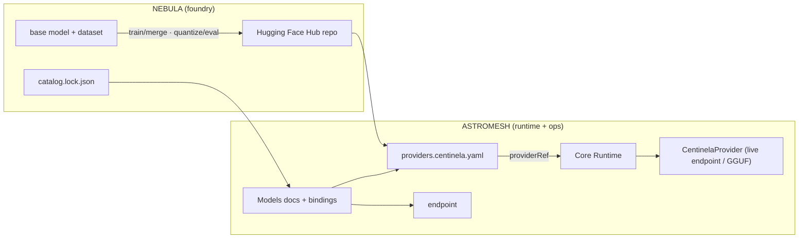

import { Aside, Badge } from '@astrojs/starlight/components';

<Aside type="tip" title="Where models are born">
Nebula is the **open-model foundry** of the Astromesh ecosystem. Every model in the
[Models catalog](/astromesh/models/) is trained, gated, and published here before the runtime
ever serves it.
</Aside>

**Astromesh Nebula** is the foundry that produces the ecosystem's *own* models. While the rest of
the platform runs and deploys agents, Nebula is the upstream step that **builds the open models
those agents can route to** — fine-tuned, quantized, evaluated behind a quality gate, and shipped
to the Hugging Face Hub with a machine-readable contract.

Its first family is **Centinela** <Badge text="preview" variant="caution" /> — Spanish-first models
for finance and back-office work in LATAM. The first release, `Centinela-Qwen3-4B`, is a financial
**sentiment** classifier (`positivo` / `neutral` / `negativo`) QLoRA-fine-tuned from `Qwen/Qwen3-4B`,
Apache-2.0, cheap enough to self-host even on CPU via GGUF.

## What Nebula Is

- An **open-model foundry**: a reproducible pipeline that turns a base model + a dataset into a
  published, versioned, evaluated model.
- A **quality gate**: no model is published unless it clears a tier gate (per-metric thresholds,
  and must strictly beat the base model).
- A **machine contract producer**: it compiles a `catalog.lock.json` that the runtime and the docs
  consume — labels, output validation, aliases, revisions, and eval metrics.
- **GitOps-native**: model promotion flows through pull requests, from the foundry all the way to a
  live serving endpoint.

## What Nebula Is NOT

- It is **not the agent runtime**. Agents execute in [Astromesh Core / Node](/astromesh/getting-started/ecosystem/),
  not in Nebula.
- It **does not serve inference**. Nebula publishes model artifacts to the Hub; a live endpoint (or
  local Ollama/GGUF) serves them. See [Provider Configuration](/astromesh/configuration/providers/).
- It is **not a general training platform**. It is an opinionated pipeline for *the ecosystem's own*
  models, one vertical family at a time.

## Ecosystem Role

Nebula sits **upstream** of everything else: it is the source of the models the runtime routes to.
The rest of the ecosystem consumes its output — the compiled catalog and the published Hub repos.

## Where to Next

| I want to... | Go to |
|--------------|-------|
| See how a model is actually built | [The Foundry Pipeline](/astromesh/nebula/pipeline/) |
| Understand the catalog contract & GitOps flow | [Catalog & GitOps](/astromesh/nebula/catalog-and-gitops/) |
| Follow a concrete model end-to-end | [How a model is made: Centinela](/astromesh/nebula/centinela/) |
| Browse the published model cards | [Models](/astromesh/models/) |
