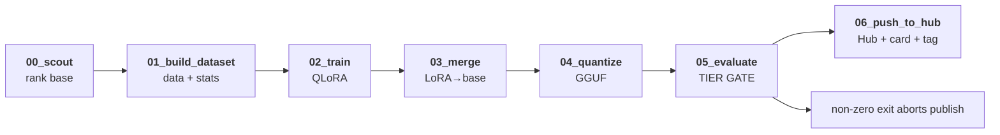

import { Aside, Badge } from '@astrojs/starlight/components';

A model is born in Nebula by running one reproducible pipeline: pick a base, build the dataset,
fine-tune, merge, quantize, **evaluate behind a gate**, and only then publish. The whole GPU run
executes as a **single Hugging Face Job** — GitHub runners have no GPU, so the heavy work runs on
the Hub (billed).

## The stages

Each stage is a small, single-purpose script in `scripts/`. Pure logic lives in `nebula/` and is
unit-tested; the scripts are thin CLIs over it.



| # | Stage | What it does |
|---|-------|--------------|
| 00 | **Scout** | Queries the HF Hub for candidate base models and ranks them; a human picks one and sets it as `base_model` in `configs/train-<name>.yaml`. |
| 01 | **Build dataset** | Materializes the training/eval JSONL and writes `stats.json` (used downstream for metadata). |
| 02 | **Train** | QLoRA fine-tune of the base model per `configs/train-4b.yaml` (LoRA adapter out). |
| 03 | **Merge** | Merges the LoRA adapter back into the base weights → a standalone model. |
| 04 | **Quantize** | Produces a `Q4_K_M` **GGUF** so the model runs cheap, even on CPU. |
| 05 | **Evaluate** | Scores the tuned model vs the base and applies the **tier gate**. |
| 06 | **Publish** | Pushes artifacts + a generated model card + a version tag to the Hub. |

## The tier gate

Publishing is **not** unconditional. Stage 05 exits non-zero if the model fails the gate, which
aborts the job before it can push anything. The gate (`configs/eval.yaml`) for Centinela-4B:

```yaml
task: sentiment_analysis
labels: [positivo, neutral, negativo]
thresholds:
  macro_f1: 0.85       # initial target; tune after baselines
  must_beat_base: true # must strictly beat base Qwen3-4B few-shot
```

<Aside type="note">
`must_beat_base` is the key discipline: a fine-tune that doesn't beat the base model few-shot is
not worth publishing. The gate encodes that as a hard, automatic stop.
</Aside>

## Running it — one job

The GPU pipeline runs *inside* a freshly-cloned HF Job via `scripts/run_pipeline.sh`. It is launched
manually from GitHub Actions (`release.yml`, `workflow_dispatch`), which authenticates to Hugging
Face and submits the job. The stages above map 1:1 to the script:

```bash
# build → train → merge → quantize → eval-gate → publish, as one HF Job
uv run python scripts/01_build_dataset.py --dataset "$DATASET" --out data/centinela
uv run python scripts/02_train.py    --config configs/train-4b.yaml ...
uv run python scripts/03_merge.py    --base Qwen/Qwen3-4B --adapter export/adapter --out export/merged
bash            scripts/04_quantize.sh export/merged export/centinela-4b.Q4_K_M.gguf
uv run python scripts/05_evaluate.py --base Qwen/Qwen3-4B --tuned export/merged ...  # gate: non-zero → abort
uv run python scripts/06_push_to_hub.py --size 4b --tag "$TAG" --gguf ...
```

### Dry run

A `STOP_BEFORE_PUBLISH=true` run executes every stage **including the gate** but stops before the
push — the eval report is printed to the job logs. It's the safe way to validate a candidate and
read its real metrics before committing to a release.

<Aside type="caution">
Launching a release is billed GPU work on the Hub and publishes under the org's write token
(`HF_TOKEN`). It is an intentional, human-triggered action — never automatic.
</Aside>

## From pipeline to platform

`06_push_to_hub` is the *artifact* half of a release. The *contract* half — recording the new
revision, its eval numbers, and its aliases so the runtime can consume it — is the catalog. That's
the next page: [Catalog & GitOps](/astromesh/nebula/catalog-and-gitops/).
