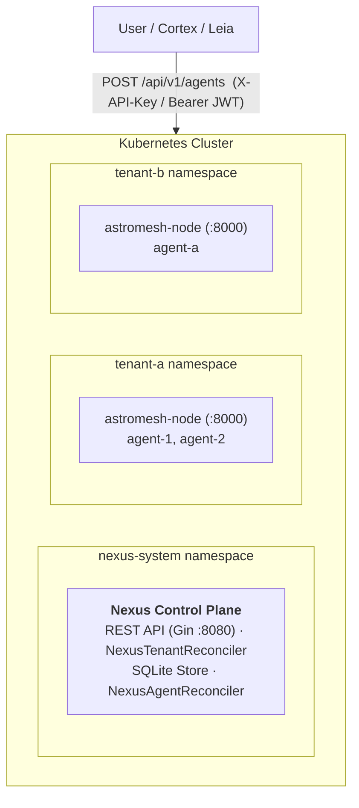
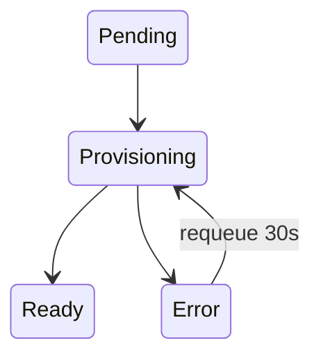
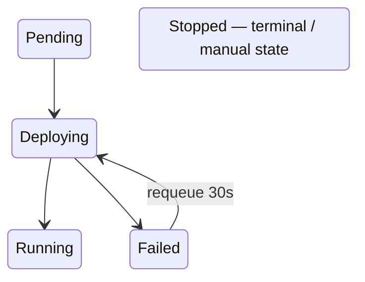

import { Aside } from '@astrojs/starlight/components';

Nexus is a controller-runtime operator with an embedded REST API. The control plane lives in the `nexus-system` namespace; tenants and their nodes live in their own namespaces.

## Control-Plane Components

| Component | Detail |
|-----------|--------|
| REST API | Gin HTTP server on `:8080`; turns client requests into custom resources |
| SQLite store | `modernc.org/sqlite` — users, tenants, tenant↔user associations, API keys, refresh tokens |
| Auth | JWT via `golang-jwt` (HMAC-SHA256), bcrypt password hashing (cost 12) |
| NexusTenantReconciler | Provisions tenant namespaces, nodes, and services |
| NexusAgentReconciler | Registers and deploys agents to tenant nodes |
| Metrics | Prometheus endpoint on `:9090` |
| Health probes | Manager liveness/readiness on `:8081` |

Built with Go 1.25, Kubebuilder v4, and controller-runtime. The CRD API group is `nexus.astromesh.io/v1alpha1`.



## Reconcilers

### NexusTenantReconciler

Watches `NexusTenant` resources in `nexus-system`. Each reconcile loop:

1. Adds a cleanup finalizer (`nexus.astromesh.io/tenant-cleanup`).
2. Sets phase to `Provisioning`.
3. Ensures the **tenant namespace** exists (labeled `nexus.astromesh.io/managed=true`).
4. Ensures the **`astromesh-node` Deployment** (1 replica, container port `8000`, liveness/readiness probes on `/v1/health`). Resource limits are applied from `spec.resourceQuota`.
5. Ensures the **`astromesh-node` Service** on port `8000`.
6. Sets phase to `Ready`, records `status.namespace`, and sets `status.nodeEndpoint` to `http://astromesh-node.<namespace>.svc:8000`.
7. Requeues after 60s.

On deletion, the finalizer deletes the tenant namespace before it is removed. Errors set phase `Error` and requeue after 30s.

### NexusAgentReconciler

Watches `NexusAgent` resources in tenant namespaces. Each reconcile loop:

1. Adds a cleanup finalizer (`nexus.astromesh.io/agent-cleanup`).
2. Sets phase to `Deploying`.
3. Resolves the tenant's node endpoint by listing `NexusTenant` CRs in `nexus-system` and matching the one whose `status.namespace` equals the agent's namespace and whose phase is `Ready`.
4. Registers the agent: `POST {node}/v1/agents`.
5. Deploys the agent: `POST {node}/v1/agents/{name}/deploy`.
6. Sets phase to `Running`, `status.nodeAck = true`, and `status.lastSyncedAt = now`.
7. Requeues after 60s.

On deletion, the finalizer calls `DELETE {node}/v1/agents/{name}` (errors ignored — the node may already be gone). Errors set phase `Failed` and requeue after 30s.

## Multi-Tenant Isolation Model

- **One namespace per tenant.** The tenant's CR name is also its namespace name.
- **One node per tenant.** Each namespace runs its own `astromesh-node`; agents never cross tenant boundaries.
- **Scoped credentials.** API keys are tenant-scoped; JWT callers must own a tenant (verified via `UserOwnsTenant`) and pass `X-Tenant-ID` to act within it.
- **Quota enforcement.** `spec.resourceQuota` drives the node's CPU/memory limits and a `maxAgents` ceiling.

<Aside type="note">
The REST API mints CR names of the form `tenant-<uuid>`. The sample manifests use a friendly name like `tenant-dev`. In both cases the CR name equals the tenant namespace name.
</Aside>

## Custom Resource Definitions

API group: `nexus.astromesh.io/v1alpha1`.

### NexusTenant

Namespaced, created in `nexus-system`.

**Spec**

| Field | Type | Description |
|-------|------|-------------|
| `displayName` | string | Human-readable tenant name |
| `nodeProfile` | string | Node profile, e.g. `"full"` (passed to the node as `ASTROMESH_ROLE`) |
| `resourceQuota.maxAgents` | int | Maximum number of agents |
| `resourceQuota.cpu` | string | CPU limit for the node (e.g. `"4"`) |
| `resourceQuota.memory` | string | Memory limit for the node (e.g. `"8Gi"`) |

**Status**

| Field | Type | Description |
|-------|------|-------------|
| `phase` | enum | `Pending` \| `Provisioning` \| `Ready` \| `Error` |
| `namespace` | string | Provisioned tenant namespace |
| `nodeEndpoint` | string | In-cluster node URL (`http://astromesh-node.<ns>.svc:8000`) |
| `agentCount` | int | Number of agents in the tenant |
| `conditions` | []Condition | Standard Kubernetes conditions |

```yaml
apiVersion: nexus.astromesh.io/v1alpha1
kind: NexusTenant
metadata:
  name: tenant-dev
  namespace: nexus-system
spec:
  displayName: "Development Tenant"
  nodeProfile: full
  resourceQuota:
    maxAgents: 10
    cpu: "4"
    memory: "8Gi"
```

### NexusAgent

Namespaced, created in the tenant's namespace.

**Spec**

| Field | Type | Description |
|-------|------|-------------|
| `agentSpec` | RawExtension | A pass-through carrying a full `astromesh/v1` Agent spec (unknown fields preserved) |

**Status**

| Field | Type | Description |
|-------|------|-------------|
| `phase` | enum | `Pending` \| `Deploying` \| `Running` \| `Failed` \| `Stopped` |
| `lastSyncedAt` | timestamp | Last successful sync with the node |
| `nodeAck` | bool | Whether the node acknowledged the deploy |
| `conditions` | []Condition | Standard Kubernetes conditions |

```yaml
apiVersion: nexus.astromesh.io/v1alpha1
kind: NexusAgent
metadata:
  name: support-bot
  namespace: tenant-dev
spec:
  agentSpec:
    apiVersion: astromesh/v1
    kind: Agent
    metadata: { name: support-bot, version: "1.0.0" }
    spec:
      identity: { display_name: "Support Bot" }
      model:
        primary: { provider: ollama, model: "llama3.1:8b" }
      orchestration: { pattern: react }
```

## State Machines

### Tenant phases



### Agent phases



## What's Next

- [Quickstart](/astromesh/nexus/quickstart/) — bootstrap on Kind and deploy an agent.
- [API Reference](/astromesh/nexus/api-reference/) — endpoints and auth.
