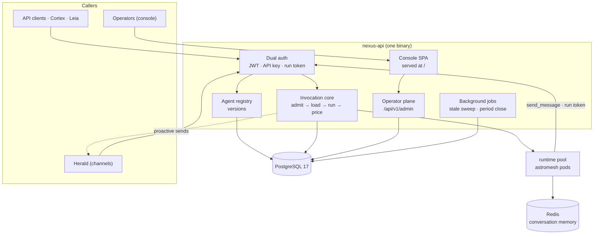
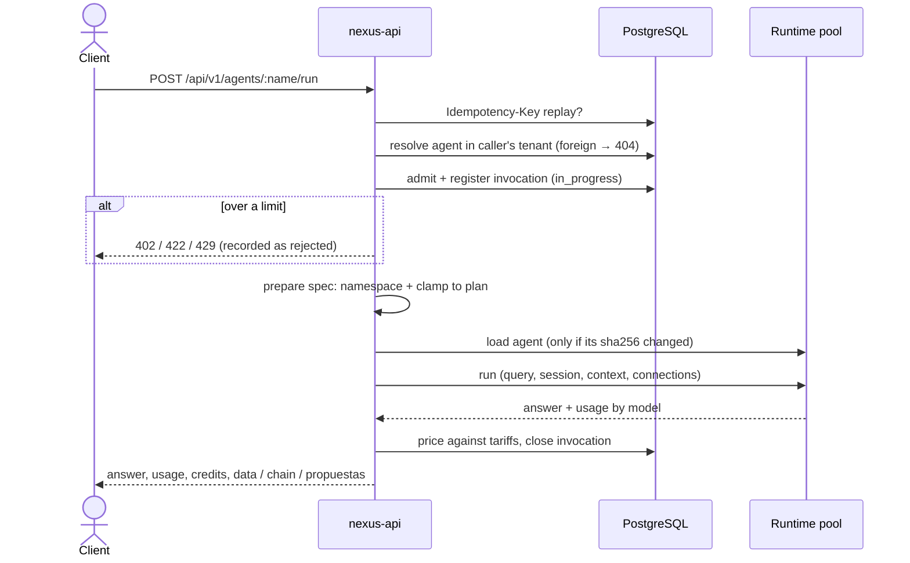

import { Aside } from '@astrojs/starlight/components';

Nexus is one Go binary (`nexus`, Gin on `:8080`) backed by PostgreSQL. It has no controllers and no Custom Resources. Agents run in a separate **runtime pool** of Astromesh pods, which Nexus reaches over HTTP.

## Components

```mermaid
flowchart TB
    subgraph clients["Callers"]
        API_C["API clients · Cortex · Leia"]
        HER["Herald (channels)"]
        OPS["Operators (console)"]
    end

    subgraph nexus["nexus-api (one binary)"]
        AUTH["Dual auth<br/>JWT · API key · run token"]
        REG["Agent registry<br/>versions"]
        INV["Invocation core<br/>admit → load → run → price"]
        ADM["Operator plane<br/>/api/v1/admin"]
        CON["Console SPA<br/>served at /"]
        JOBS["Background jobs<br/>stale sweep · period close"]
    end

    DB[("PostgreSQL 17")]
    POOL["runtime pool<br/>astromesh pods"]
    REDIS[("Redis<br/>conversation memory")]

    API_C --> AUTH
    HER --> AUTH
    OPS --> CON --> ADM
    AUTH --> REG & INV
    REG --> DB
    INV --> DB
    INV --> POOL
    ADM --> DB
    JOBS --> DB
    POOL --> REDIS
    POOL -->|"send_message · run token"| AUTH
    INV -.->|"proactive sends"| HER
```

| Component | What it does |
|---|---|
| **Dual auth** | Resolves the tenant from a Bearer JWT (with `X-Tenant-ID`) or an `X-API-Key`. A third credential, the per-run token, is accepted only on `/api/v1/runs/*`. |
| **Agent registry** | Stores specs and their append-only version history. |
| **Invocation core** | The run path shared by the REST and WebSocket adaptors (below). |
| **Operator plane** | Tariffs, plans, subscriptions, cross-tenant reads and billing, behind the operator role. Every mutation is audited. |
| **Console** | A React SPA embedded in the binary and served at `/`. See [Operations](/astromesh/nexus/operations/#operator-console). |
| **Background jobs** | The stale-invocation sweep and the monthly period close, both inside `nexus-api`. |
| **Runtime pool** | Astromesh pods pinned to one runtime version. Agents are held in memory; conversational memory lives in Redis. |

## The run path

Every run, synchronous or streamed, goes through the same prologue:

```mermaid
sequenceDiagram
    actor C as Client
    participant N as nexus-api
    participant DB as PostgreSQL
    participant P as Runtime pool

    C->>N: POST /api/v1/agents/:name/run
    N->>DB: Idempotency-Key replay?
    N->>DB: resolve agent in caller's tenant (foreign → 404)
    N->>DB: admit + register invocation (in_progress)
    alt over a limit
        N-->>C: 402 / 422 / 429 (recorded as rejected)
    end
    N->>N: prepare spec: namespace + clamp to plan
    N->>P: load agent (only if its sha256 changed)
    N->>P: run (query, session, context, connections)
    P-->>N: answer + usage by model
    N->>DB: price against tariffs, close invocation
    N-->>C: answer, usage, credits, data / chain / propuestas
```

1. **Idempotency.** An `Idempotency-Key` becomes the invocation id. A replayed key returns the existing invocation without dispatching; a key owned by another tenant is `409`.
2. **Resolve and isolate.** The agent is looked up inside the caller's tenant only. An agent with no live version answers `422`.
3. **Admit before executing.** The invocation is registered against the tenant's plan (and its subscription's plan, if any) in one transaction: concurrency, requests per minute and credits for the period. A rejection is recorded with its reason. See [Plans & Billing](/astromesh/nexus/billing/#admission).
4. **Prepare the spec.** `metadata.name` becomes `t_<tenant>__<agent>`, and so do the names of agents referenced as `type: agent` tools. `max_tokens` and `max_iterations` are clamped to the plan's ceilings.
5. **Load.** Nexus remembers the sha256 of the spec it last pushed per agent and serializes pushes with a per-agent lock. An unchanged spec is not pushed again, a restarted runtime (404) is reloaded, and referenced sub-agents are loaded too, up to 16 per invocation.
6. **Run.** The runtime receives the query, the session id (namespaced as `t_<tenant>__<agent>__<session>`), the caller's `context`, the tenant's connection bundle and, when Herald is configured, a per-run token.
7. **Price and close.** Per-model usage is priced against the tariffs in force when the run started. The invocation closes with its status, credits and costs.

The **stale sweep** marks any invocation still `in_progress` after `--sweep-max-age` (default 300 s) as `interrupted`, so a crashed run never holds a concurrency slot forever.

<Aside type="note">
A sub-agent called as a tool does not create a second invocation: the runtime runs it in-process inside the parent's run, and its usage is part of the parent's. What it did is in the parent's trace.
</Aside>

## Invocation statuses

| Status | Meaning |
|---|---|
| `in_progress` | Admitted and running. |
| `ok` | Finished; priced. |
| `error` | The runtime or provider failed. |
| `timeout` | Exceeded `--run-timeout` (default 120 s). |
| `cancelled` | A streaming client closed its socket; charged zero credits. |
| `rejected` | Refused at admission; `error_code` holds the reason. |
| `interrupted` | Closed by the stale sweep. |

## Data model

All state is in one PostgreSQL schema that `nexus` creates and migrates itself at boot. There is no migration job, and a second boot emits no DDL.

| Area | Tables |
|---|---|
| Identity | `users` (with `is_operator`), `refresh_tokens`, `tenants`, `user_tenants`, `api_keys` |
| Registry | `agents`, `agent_versions` |
| Execution | `invocations`, `invocation_model_usage`, `usage_counters` |
| Pricing | `model_tariffs`, `plans` |
| Subscriptions | `subscriptions`, `subscription_counters`, `usage_events` |
| Billing | `billing_periods`, `charges` |
| Connections | `connections` |
| Audit | `operator_audit` |

Invariants the database enforces itself, not the application:

- **`agent_versions`, `model_tariffs`, `plans` and `charges` are append-only**, guarded by triggers on `UPDATE`, `DELETE` and `TRUNCATE`. Changing a price files a new tariff row with a later `effective_from`.
- **Nothing is hard-deleted.** Tenants, agents and API keys are soft-deleted, so a version keeps its author and a past invocation keeps its agent. Deleting a tenant revokes its keys, removes its owners' access and cancels its active subscriptions in the same transaction.
- **A version's checksum** is `sha256` of the spec as PostgreSQL stores it, so it can be recomputed from the row.

## Agents and versions

Publishing (`POST`/`PUT /api/v1/agents`) validates the spec against the `astromesh/v1` Agent schema, accepts YAML or JSON, and appends a version with its number, date, author (the user, or the API key that wrote it) and checksum. An agent's `status` is `draft` until it has a live version and `active` from then on.

Names are unique among a tenant's live agents only, so a retired name can be reused. The `by-id` routes address a version history unambiguously; `by-id` is therefore not a valid agent name.

## Tenant isolation

- Every read and write is scoped by the tenant the credential resolved. The tenant never comes from a request body or, for connections and sends, from the path.
- An API key reaches its own tenant only. A JWT reaches the tenants its user owns, selected with `X-Tenant-ID`; an operator's JWT may name any tenant.
- The run's connection bundle is built from the database for the resolved tenant, never from anything the caller sent.
- Provider and infrastructure costs never appear in customer-facing responses; they are on the operator plane only.

## Technology

| Component | Technology |
|---|---|
| API | Go 1.25, Gin |
| Database | PostgreSQL 17 (JSONB) |
| Console | React 19 + Vite, embedded with `go:embed` |
| Runtime pool | The `astromesh` image, version pinned in `deploy/components/runtime-pool` (0.61.0 at Nexus 0.26.2) |
| Conversation memory | Redis (`allkeys-lru`, no persistence) |
| Deploy | Kustomize overlays, ArgoCD, ArgoCD Image Updater |
| Logging | zerolog |
