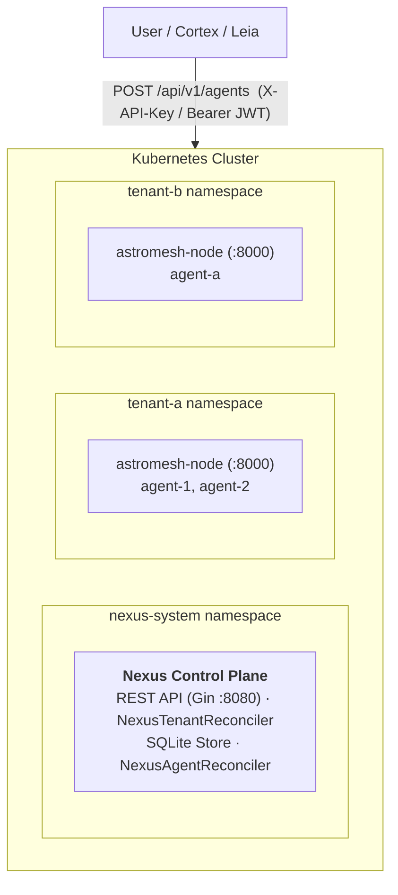

import { Aside } from '@astrojs/starlight/components';

<Aside type="caution">
**v0.3.0 · CRDs are `v1alpha1`.** Nexus is pre-1.0. The `nexus.astromesh.io/v1alpha1` API group is under active development and breaking changes to CRD schemas and REST endpoints are possible between minor releases.
</Aside>

**Astromesh Nexus** is a Kubernetes operator that acts as the **multi-tenant control plane** for the Astromesh ecosystem. It provisions isolated tenants — one Kubernetes namespace each — deploys a dedicated [`astromesh-node`](/astromesh/node/introduction/) instance per tenant, and synchronizes AI agents into those nodes through a single REST API.

External clients call the Nexus REST API; Nexus translates those calls into custom resources; reconcilers then drive the per-tenant nodes that actually run the agents.

## What Nexus Is

- A **Kubernetes operator** built with Kubebuilder v4 and controller-runtime.
- A **multi-tenant control plane** that isolates each tenant in its own namespace.
- A **provisioner**: it stands up an `astromesh-node` Deployment and Service per tenant.
- An **agent synchronizer**: it registers and deploys agents to the right tenant node and tracks their status.
- A **REST API gateway** (Gin, `:8080`) with dual authentication for interactive users and programmatic clients.

## What Nexus Is NOT

- It is **not the agent runtime**. Agents execute inside [`astromesh-node`](/astromesh/node/introduction/) (port `8000`), not in Nexus.
- It **does not execute agents directly**. Nexus turns API requests into custom resources and lets the node run them.
- It is **not a single-tenant tool**. Its entire design centers on tenant isolation.

## Ecosystem Role

Nexus is the cloud control plane that the rest of the ecosystem deploys agents to. [Cortex](/astromesh/cortex/introduction/), Forge, and [Leia](/astromesh/leia/introduction/) all target Nexus, which fans agents out to per-tenant nodes. See the [ecosystem overview](/astromesh/getting-started/ecosystem/) for the full picture.

## Key Concepts

### Tenants

A tenant is an isolated workspace. Creating one provisions a dedicated Kubernetes namespace and a per-tenant `astromesh-node`. Tenants are modeled by the `NexusTenant` CRD and carry a `resourceQuota` (max agents, CPU, memory).

### Per-Tenant Node

Every tenant gets its own `astromesh-node` Deployment and Service inside its namespace, listening on port `8000` with health probes on `/v1/health`. Nexus records the node's in-cluster endpoint on the tenant's `status.nodeEndpoint`.

### Agents

Agents are defined by the `NexusAgent` CRD, whose spec carries a full `astromesh/v1` Agent spec as a pass-through. The `NexusAgentReconciler` registers and deploys each agent to its tenant's node and reports `phase`, `nodeAck`, and `lastSyncedAt`.

### Dual Authentication

The REST API accepts two credential types: a **Bearer JWT** (interactive sessions, optionally scoped with an `X-Tenant-ID` header) or an **`X-API-Key`** (programmatic, tenant-scoped). Auth and health routes are public; everything under `/api/v1/*` requires one of the two.

## What's Next

- [Architecture](/astromesh/nexus/architecture/) — control-plane components, reconcilers, and the two CRDs.
- [Quickstart](/astromesh/nexus/quickstart/) — bootstrap Nexus on Kind and deploy your first agent.
- [API Reference](/astromesh/nexus/api-reference/) — auth model, endpoints, and a curl walkthrough.
