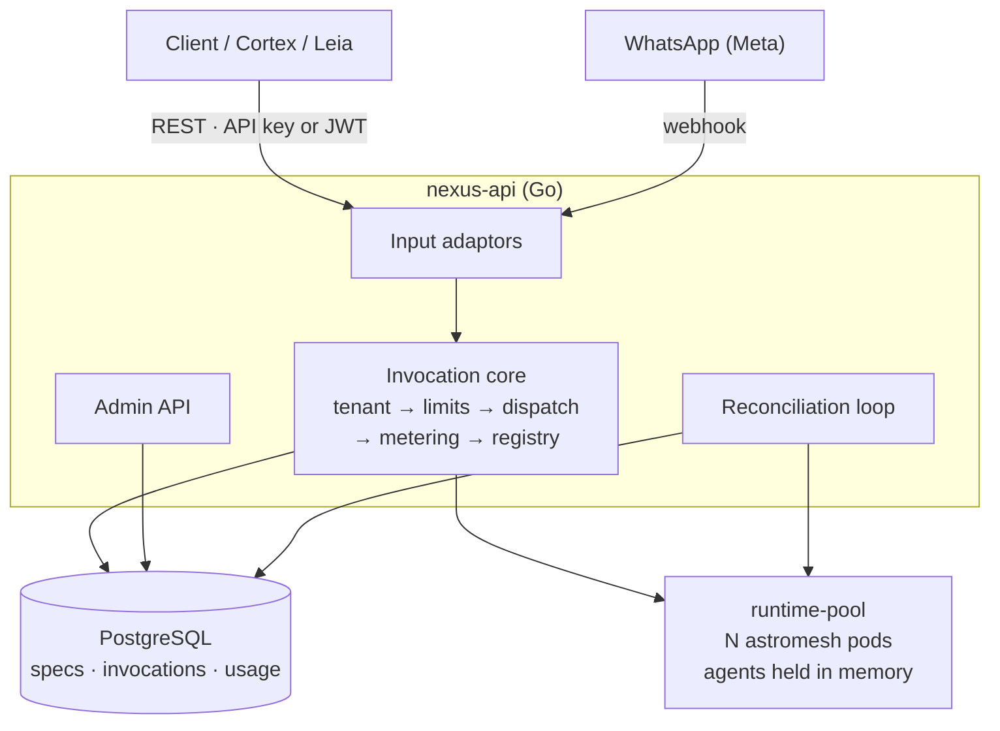

import { Aside } from '@astrojs/starlight/components';

<Aside type="caution">
**v0.9.0 · pre-1.0.** Nexus was reoriented away from its original Kubernetes-operator design (one namespace and one dedicated `astromesh-node` per customer) toward a **managed platform** with a shared runtime pool, per-use accounting and a web console. Endpoints and data shapes can still change between minor releases.
</Aside>

**Astromesh Nexus** is the control plane of the agent cloud: it publishes, executes, meters and bills the agents that run on the Astromesh runtime, in multi-tenancy.

External clients call the Nexus REST API. Nexus resolves the tenant, applies its limits, dispatches the run to a shared pool of runtimes, measures what it consumed, and records the invocation.

## What Nexus is

- A **managed multi-tenant control plane**, written in Go (Gin, `:8080`).
- An **agent registry with versioning** — specs live in PostgreSQL, each publish appending a new version with its author and checksum.
- An **invocation core**: tenant → limits → dispatch → metering → registry.
- A **billing and observability surface**: per-agent and per-tenant consumption, per-model breakdown, and nested sub-invocations.
- A **streaming adaptor**: runs can be streamed over WebSocket, cancelled mid-flight, and billed at stream close.

## What Nexus is not

- It is **not the agent runtime**. Agents execute inside the Astromesh runtime pool, not in Nexus.
- It is **no longer a Kubernetes operator**. Agents are rows in PostgreSQL with versioning, not Custom Resources in etcd, and tenants no longer get a dedicated namespace and node each.
- It is **not single-tenant**. Tenant isolation and per-tenant accounting are the whole point.

## Architecture

```mermaid
flowchart TB
    User["Client / Cortex / Leia"] -->|"REST · API key or JWT"| API
    WA["WhatsApp (Meta)"] -->|webhook| API

    subgraph nexus["nexus-api (Go)"]
        API["Input adaptors"]
        CORE["Invocation core
        tenant → limits → dispatch
        → metering → registry"]
        ADMIN["Admin API"]
        LOOP["Reconciliation loop"]
        API --> CORE
    end

    DB[("PostgreSQL
    specs · invocations · usage")]
    POOL["runtime-pool
    N astromesh pods
    agents held in memory"]

    CORE --> DB
    CORE --> POOL
    ADMIN --> DB
    LOOP --> DB
    LOOP --> POOL
```

The **runtime pool** is a cache, not a registry: pods start empty and Nexus injects agents through the runtime API (`ASTROMESH_PERSIST_AGENTS=0`). The durable copy of every spec lives in PostgreSQL.

## Key concepts

### Tenants

A tenant is an isolated workspace with its own agents, API keys, plan and consumption. Isolation is enforced in the data layer and in every query, not by a Kubernetes namespace boundary.

### Agents and versions

An agent carries a full `astromesh/v1` spec. Publishing appends a **new version** with its number, date, author and checksum; earlier versions stay readable and can be reverted to by republishing their spec.

### Dual authentication

The REST API accepts a **Bearer JWT** (interactive sessions, optionally scoped with `X-Tenant-ID`) or an **`X-API-Key`** (programmatic, tenant-scoped). Auth and health routes are public; everything under `/api/v1/*` requires one of the two. Operator-only admin routes take a separate `X-Operator-Token`.

## What's new

### v0.9.0 — tenant usage endpoint

`GET /api/v1/usage[?period=YYYY-MM]` reports tenant-wide consumption: current-month and all-time totals (invocations, tokens and the three money columns) plus a per-agent ranking by credits, including soft-deleted agents flagged `deleted`. `period` defaults to the current UTC month.

### v0.8.0 — streaming runs and real observability

`GET /api/v1/agents/:name/run/stream` (WebSocket) proxies the runtime's per-run execution events to the client and bills credits at stream close, reusing the synchronous path's pricing. All HTTP-status validation happens **before** the upgrade. Closing the client socket cancels the run server-side and records the invocation as `cancelled` with zero credits.

The same release replaced the earlier stubs with real aggregation: `GET /api/v1/agents/:name/metrics` and `GET /api/v1/agents/:name/invocations/:id` read from the invocation registry, exposing per-model usage and child invocations.

### v0.7.0 — the runtime pool

A Kustomize component deploys the Astromesh runtime that Nexus dispatches to, behind a ClusterIP service, so `POST /api/v1/agents/:name/run` actually executes instead of failing `502`/`504`.

### v0.6.0 — Kubernetes deployment

Kustomize base plus per-environment overlays for **dev** and **mvp**, one ArgoCD Application each.

## Ecosystem role

Nexus is the cloud control plane the rest of the ecosystem deploys agents to. [Cortex](/astromesh/cortex/introduction/), Forge and [Leia](/astromesh/leia/introduction/) all target it. See the [ecosystem overview](/astromesh/getting-started/ecosystem/) for the full picture.

## What's next

- [Architecture](/astromesh/nexus/architecture/) — control-plane components and data model.
- [Quickstart](/astromesh/nexus/quickstart/) — bootstrap Nexus and deploy your first agent.
- [API Reference](/astromesh/nexus/api-reference/) — auth model, endpoints, and a curl walkthrough.
