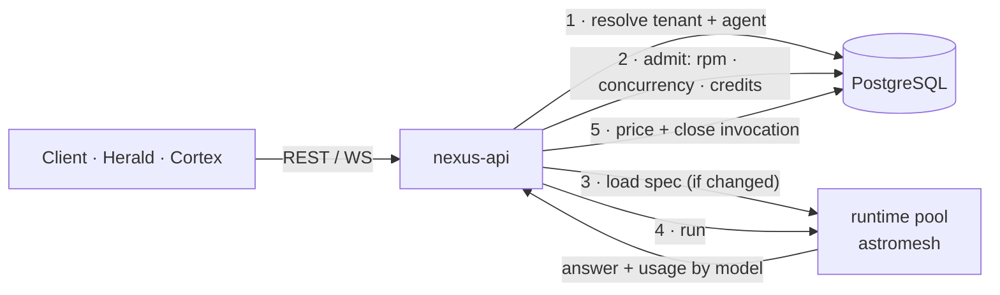

import { Aside } from '@astrojs/starlight/components';

<Aside type="caution">
**v0.26.5 · pre-1.0.** Endpoints and data shapes can still change between minor releases.
</Aside>

**Astromesh Nexus** is the control plane of the agent cloud. It publishes, executes, meters and bills the agents that run on the Astromesh runtime, for many tenants at once.

A client calls the Nexus REST API. Nexus resolves the tenant, admits the run against its limits, loads the agent into a shared pool of runtimes, measures what the run consumed, prices it, and records the invocation.

## What Nexus does

| Area | What you get |
|---|---|
| **Tenants and access** | Users, tenants, API keys and an operator role. JWT for people, `X-API-Key` for programs. |
| **Agent registry** | Full `astromesh/v1` specs in PostgreSQL. Every publish appends an immutable version with its author and checksum. |
| **Execution** | Synchronous runs (`POST …/run`) and WebSocket streaming with server-side cancel, dispatched to a shared runtime pool. |
| **Admission** | Per-plan caps on concurrency, requests per minute and credits per period, plus token and iteration ceilings clamped into the spec. |
| **Metering and pricing** | Per-model token usage (including the provider's prompt cache), priced against effective-dated tariffs into credits. |
| **Subscriptions and billing** | Plans sold per vertical (*argo*), business-unit usage events, and a monthly period close that writes charges and a statement. |
| **Connections** | Per-tenant credentials (an ERP key, an API, an MCP server), sealed with AES-256-GCM and forwarded to each run. |
| **Messaging** | Proactive sends through [Herald](/astromesh/herald/introduction/), including from an agent mid-run with a per-run token. |
| **Observability** | Per-agent status, logs and metrics, invocation detail, tenant usage, and cross-tenant reads for operators. |
| **Operator console** | A web console embedded in the binary: platform, customers, agent health, invocations, plans and tariffs, billing. |

## What Nexus is not

- **Not the agent runtime.** Agents execute inside the Astromesh runtime pool. Nexus decides whether a run may happen and what it cost.
- **Not a Kubernetes operator.** Agents are rows in PostgreSQL, not Custom Resources, and tenants share one runtime pool instead of getting a namespace and a node each.
- **Not single-tenant.** Tenant isolation and per-tenant accounting are enforced in every query.

## How a run flows

```mermaid
flowchart LR
    C["Client · Herald · Cortex"] -->|"REST / WS"| N["nexus-api"]
    N -->|"1 · resolve tenant + agent"| DB[("PostgreSQL")]
    N -->|"2 · admit: rpm · concurrency · credits"| DB
    N -->|"3 · load spec (if changed)"| P["runtime pool<br/>astromesh"]
    N -->|"4 · run"| P
    P -->|"answer + usage by model"| N
    N -->|"5 · price + close invocation"| DB
```

The pool is a cache, not a registry: Nexus pushes a tenant's agent into it on first use and again only when the spec changed. The durable copy of every spec lives in PostgreSQL.

## Where Nexus fits

| | |
|---|---|
| [**Astromesh runtime**](/astromesh/getting-started/what-is-astromesh/) | What the pool runs. Each Nexus release pins one runtime version (astromesh 0.64.0 at Nexus 0.26.5). |
| [**Herald**](/astromesh/herald/introduction/) | The messaging gateway. Herald invokes agents through Nexus; Nexus sends proactive messages through Herald. |
| [**Cortex**](/astromesh/cortex/introduction/) | The desktop console. It connects to Nexus as a managed hub to publish agents. |
| [**Leia**](/astromesh/leia/introduction/) | The same operations in natural language, from Claude Code. |

## Next

- [Architecture](/astromesh/nexus/architecture/): components, data model, the run path and its guarantees.
- [Quick Start](/astromesh/nexus/quickstart/): deploy Nexus and run your first agent.
- [API Reference](/astromesh/nexus/api-reference/): every route, its auth and its errors.
- [Plans & Billing](/astromesh/nexus/billing/): admission, credits, tariffs, subscriptions and the period close.
- [Operations](/astromesh/nexus/operations/): configuration, the console, `nexus-admin`, deploy and backups.
