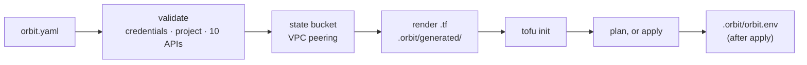

import { Aside } from '@astrojs/starlight/components';

<Aside type="note" title="v0.4.4">
Orbit ships one provider, **GCP**. The schema already names `aws` and `azure`, but choosing either
fails with `Provider 'aws' not supported`.
</Aside>

**Astromesh Orbit** turns one `orbit.yaml` into a running Astromesh stack on Google Cloud. It
renders Terraform from templates, runs it with OpenTofu or Terraform, and wires the pieces
together: a Cloud Run service for the runtime, PostgreSQL on Cloud SQL, Redis on Memorystore,
Secret Manager, a VPC connector, a service account, and optionally a RAG documents bucket, an
Artifact Registry, a monitoring dashboard and Cloud Trace.

```bash
astromeshctl orbit init     # writes orbit.yaml
astromeshctl orbit plan     # validates, renders, plans
astromeshctl orbit apply    # asks, then provisions
```

Orbit is a plugin of the [Astromesh CLI](/astromesh/reference/cli-commands/): installing
`astromesh-orbit` adds the `orbit` subcommand to `astromeshctl`. [Cortex](/astromesh/cortex/runtimes/#google-cloud-run)
drives the same commands from a wizard.

## What it saves you

| By hand | With Orbit |
|---|---|
| Write and maintain the Terraform for ~20 resources | Keep a ~40-line `orbit.yaml` |
| Create the state bucket before `terraform init` | Created (with versioning) on first `plan` or `apply` |
| Set up private services access so Cloud SQL has no public IP | Done for you when you authenticate with a service-account key |
| Wire database, Redis, bucket and tracing into the container's environment | Rendered into the Cloud Run service |
| Check that a dozen APIs are enabled | `plan` checks ten and prints the command for each missing one |

## How a deploy runs



Only `orbit.yaml` belongs in git. The rendered Terraform, its cache and `orbit.env` live in
`.orbit/`, which `orbit init` adds to `.gitignore`. State lives in a GCS bucket, so any machine
with the same `orbit.yaml` and credentials sees the same deployment.

## What gets created

| Resource | From | Notes |
|---|---|---|
| Cloud Run v2 service `astromesh-runtime` | `spec.compute.runtime`, `spec.images` | Port 8000; public (`allUsers` can invoke it) |
| Cloud SQL for PostgreSQL `<name>-db` | `spec.database` | Private IP only, SSD, daily backups |
| Memorystore for Redis `<name>-cache` | `spec.cache` | Redis 7.0 on the default network |
| Secret Manager secrets | `spec.secrets` | `<name>-jwt-secret` with a generated value; `<name>-fernet-key`, empty |
| VPC Access connector | always | `10.8.0.0/28` on the default network; Cloud Run egress to private ranges only |
| Service account `astromesh-orbit` | always | Cloud SQL client, Redis editor, secret accessor, Run invoker |
| GCS bucket `<project>-<name>-rag-docs` | `spec.storage.rag_documents` | On by default |
| Artifact Registry `<name>-images` | `spec.storage.artifact_registry` | On by default |
| Cloud Monitoring dashboard | `spec.observability.dashboard` | On by default |
| OTel Collector sidecar → Cloud Trace | `spec.observability.tracing` | Off by default |

Details for each one are in [GCP Provider](/astromesh/orbit/gcp-provider/).

## Leaving Orbit

`orbit eject` writes the same Terraform as plain files with no Orbit dependency, plus a
`terraform.tfvars`, pointing at the same state bucket. From there you run `terraform`
yourself; nothing needs migrating.

## Next steps

- [Quick Start](/astromesh/orbit/quickstart/) — from an empty project to a running runtime
- [Configuration](/astromesh/orbit/configuration/) — every `orbit.yaml` field and the two presets
- [GCP Provider](/astromesh/orbit/gcp-provider/) — resources, environment, permissions, security
- [CLI Reference](/astromesh/orbit/cli-reference/) — the eight commands
