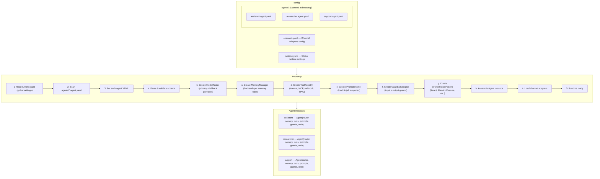
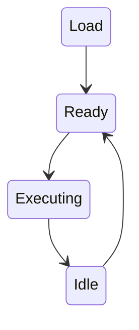

The Runtime Engine is the central orchestrator that bootstraps agents from declarative YAML configuration and manages their lifecycle. It lives in `astromesh/runtime/engine.py`.

## AgentRuntime Class

`AgentRuntime` is the top-level entry point for the platform. It scans configuration directories, parses agent definitions, assembles fully-wired `Agent` instances, and exposes a single execution method.

### Constructor

```python
AgentRuntime(config_dir: str | Path = "config/")
```

| Parameter | Type | Default | Description |
|-----------|------|---------|-------------|
| `config_dir` | `str \| Path` | `"config/"` | Root configuration directory containing `agents/`, `channels.yaml`, and other config files |

### Methods

#### `runtime.run(agent_name, query, session_id)`

Execute a named agent with a user query.

```python
async def run(
    agent_name: str,
    query: str,
    session_id: str | None = None,
) -> AgentResponse
```

| Parameter | Type | Required | Description |
|-----------|------|----------|-------------|
| `agent_name` | `str` | Yes | Name of the agent as defined in YAML (`metadata.name`) |
| `query` | `str` | Yes | User input text |
| `session_id` | `str \| None` | No | Session identifier for memory continuity. Auto-generated if omitted |

**Returns:** `AgentResponse` containing the agent's reply text, tool call logs, token usage, and timing metadata.

**Execution pipeline:** Query received -> input guardrails -> build memory context -> render Jinja2 prompt -> orchestration pattern (ReAct/PlanAndExecute/etc.) -> model router -> tool calls -> output guardrails -> persist memory -> return response.

#### `runtime.get_agent(agent_name)`

Retrieve a loaded Agent instance by name.

```python
def get_agent(agent_name: str) -> Agent
```

Raises `AgentNotFoundError` if the agent is not loaded.

#### `runtime.list_agents()`

Return a list of all loaded agent names.

```python
def list_agents() -> list[str]
```

## Configuration Loading Flow



## Agent Lifecycle

Each agent transitions through four states:



| State | Description |
|-------|-------------|
| **Load** | YAML parsed, services assembled, agent instance created. Occurs once at bootstrap |
| **Ready** | Agent is fully wired and available to handle requests. All providers have passed health checks |
| **Executing** | Agent is actively processing a query through the execution pipeline |
| **Idle** | Execution complete, agent returns to ready state waiting for the next request |

An agent can handle multiple concurrent requests. Each request transitions independently through Executing -> Idle while the agent itself remains in Ready state.

## Agent YAML Schema

Each agent file must conform to the following top-level structure:

```yaml
apiVersion: astromesh/v1
kind: Agent
metadata:
  name: my-agent
  description: "Agent description"
spec:
  identity: { ... }
  model: { ... }
  prompts: { ... }
  orchestration: { ... }
  tools: [ ... ]
  memory: { ... }
  guardrails: { ... }
  permissions: { ... }
```

| Field | Required | Description |
|-------|----------|-------------|
| `apiVersion` | Yes | Must be `astromesh/v1` |
| `kind` | Yes | Must be `Agent` |
| `metadata.name` | Yes | Unique agent identifier (used in API paths and `runtime.run()`) |
| `metadata.description` | No | Human-readable description |
| `spec.identity` | Yes | Agent persona (name, role, personality traits) |
| `spec.model` | Yes | Primary model, fallback model, routing strategy |
| `spec.prompts` | Yes | Jinja2 system prompt template and variables |
| `spec.orchestration` | Yes | Pattern name, max iterations, timeout |
| `spec.tools` | No | List of tools the agent can use |
| `spec.memory` | No | Memory types and backend configuration |
| `spec.guardrails` | No | Input and output guardrail rules |
| `spec.permissions` | No | Allowed actions and resource limits |

## Error Handling

| Error | Cause | Behavior |
|-------|-------|----------|
| `AgentNotFoundError` | `run()` called with unknown agent name | Raised immediately |
| `ConfigValidationError` | Invalid YAML schema at bootstrap | Agent skipped, warning logged, other agents still load |
| `ProviderUnavailableError` | All providers (primary + fallback) fail health check | Agent loads but requests fail until a provider recovers |
