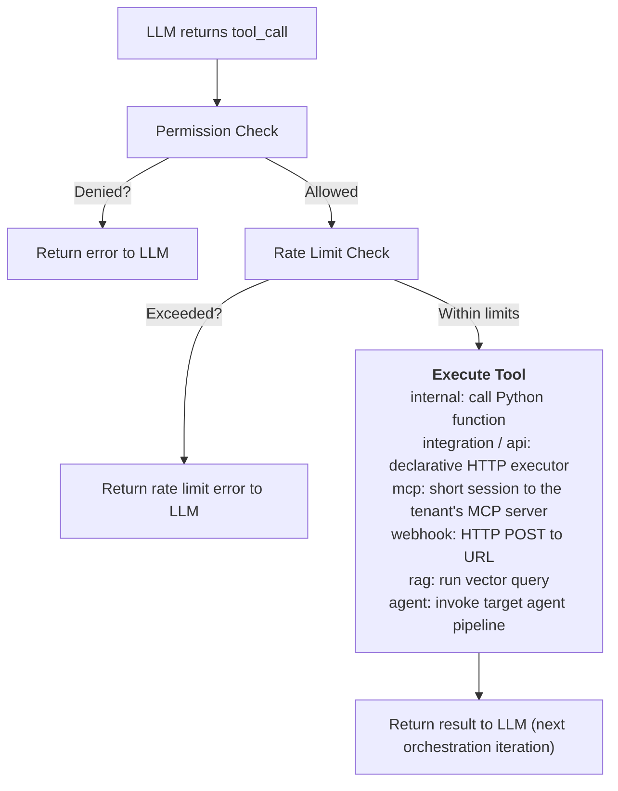

The Tool Registry manages tool discovery, registration, schema generation, and execution for all agents. It lives in `astromesh/core/tools.py`.

## Tool Types

The registry knows these tool types, each with a different execution model:

| Type | Source | Execution | Use Case |
|------|--------|-----------|----------|
| **builtin** | Astromesh's 18 built-in Python tools | ToolLoader auto-discovery + async execute | Common tasks (HTTP, files, search, DB, email) |
| **internal** | Custom Python functions in the codebase | Direct async function call | Custom capabilities specific to your application |
| **integration** | A catalog manifest (`integration.yaml`) | Declarative HTTP executor, credential from the run's connection | SaaS and ERP APIs — see [Integrations](/astromesh/configuration/integrations/) |
| **api** | A tenant's API spec, inline in the agent YAML | Same executor as `integration`, public hosts only, IP-pinned | The tenant's own REST API |
| **mcp** | A tenant's MCP server, with an inline snapshot of its tools | One short MCP session per call over a pinned transport | The tenant's own MCP server |
| **webhook** | External HTTP endpoints | HTTP POST to configured URL | Legacy APIs, microservices, serverless functions |
| **RAG** | RAG pipeline exposed as a tool | Runs ingest/query pipeline internally | Knowledge retrieval, document Q&A |
| **agent** | Another Astromesh agent | Invokes target agent's full pipeline via `AgentRuntime.run()` | Multi-agent composition, delegation, specialist agents |

From an agent YAML the declarable types are `builtin`, `agent`, `client`, `integration`,
`api` and `mcp`. `internal`, `webhook` and `rag` are registry types a YAML cannot declare —
the loader warns and skips them (the sections below describe the registry side).

## Registration

Tools are registered in the agent YAML under `spec.tools`:

### Built-in Tools

Astromesh ships with 18 ready-to-use tools. Use `type: builtin` and the tool resolves automatically via `ToolLoader`:

```yaml
spec:
  tools:
    - name: web_search
      type: builtin
      config:
        provider: tavily
        api_key: ${TAVILY_API_KEY}
    - name: http_request
      type: builtin
      config:
        timeout_seconds: 30
    - name: sql_query
      type: builtin
      config:
        connection_string: "sqlite:///data/app.db"
        read_only: true
```

At bootstrap, `_build_agent()` creates each builtin tool via `ToolLoader.create()` and registers it as an internal tool. No handler function or parameter schema is needed — these come from the tool class itself.

See the full catalog in the [Built-in Tools](/astromesh/reference/core/builtin-tools/) reference.

### Internal Tools

```yaml
spec:
  tools:
    - name: web_search
      type: internal
      description: "Search the web for current information"
      parameters:
        query:
          type: string
          description: "Search query"
          required: true
        max_results:
          type: integer
          description: "Maximum number of results to return"
          required: false
          default: 5
```

### API and MCP Tools

`type: api` (since **v0.57.0**) registers each operation of a tenant's API spec as
`<slug>_<operation>`, reusing the integration executor with `permitir_internos=False`: the
destination must resolve to public addresses only, and the connection is pinned to the
checked IP.

`type: mcp` (since **v0.58.0**) registers each tool of an **inline snapshot** of a tenant's
MCP server as `<slug>_<tool>`, with the snapshot's `input_schema`, without connecting at
build time — the runtime does not call `tools/list`. Each call is a short session
(`initialize` + `tools/call` + close) through `llamar_tool_mcp`, which never raises: every
failure comes back as the tool's error. Requires the `mcp` extra (`mcp>=1.28.1,<2`).

```yaml
spec:
  tools:
    - name: soporte
      type: mcp
      connection: soporte_mcp        # base_url + credential, resolved per run
      path: /mcp
      auth: { scheme: bearer }
      tools:
        - name: buscar_ticket
          description: Find a support ticket by number.
          writes: false
          input_schema: { type: object, properties: { numero: { type: string } } }
```

Both are read-only unless an operation declares `writes: true` with `mode: propose`
(since **v0.59.0**): that tool is registered with a handler that validates and records the
arguments for approval, and never calls the tenant. An `api` or `mcp` tool whose name
collides with any other tool of the agent fails the load. Full reference:
[Tenant APIs & MCP Servers](/astromesh/configuration/tenant-apis-and-mcp/).

### Webhook Tools

```yaml
spec:
  tools:
    - name: send_email
      type: webhook
      description: "Send an email via the email service"
      webhook:
        url: "https://api.internal.example.com/send-email"
        method: POST
        headers:
          Authorization: "Bearer ${EMAIL_API_KEY}"
        timeout: 10
      parameters:
        to:
          type: string
          required: true
        subject:
          type: string
          required: true
        body:
          type: string
          required: true
```

| Webhook Field | Required | Default | Description |
|---------------|----------|---------|-------------|
| `url` | Yes | -- | Target endpoint URL. Supports `${ENV_VAR}` substitution |
| `method` | No | `POST` | HTTP method |
| `headers` | No | -- | Headers to include. Supports `${ENV_VAR}` substitution |
| `timeout` | No | `30` | Request timeout in seconds |

### RAG Tools

```yaml
spec:
  tools:
    - name: knowledge_base
      type: rag
      description: "Search the product knowledge base"
      rag:
        collection: "product_docs"
        top_k: 5
        score_threshold: 0.7
```

| RAG Field | Required | Default | Description |
|-----------|----------|---------|-------------|
| `collection` | Yes | -- | Vector store collection name |
| `top_k` | No | `5` | Number of results to return |
| `score_threshold` | No | `0.0` | Minimum similarity score (0.0 -- 1.0) |

### Agent Tools

Agent tools let one agent invoke another agent as a tool. The target agent runs its full execution pipeline (memory, guardrails, orchestration) and returns its answer (plus `data` / `data_error` when it declares an `output_schema`) — not its steps or its trace, which would otherwise land in the calling model's context.

```yaml
spec:
  tools:
    - name: qualify-lead
      type: agent
      agent: sales-qualifier
      description: "Qualify a sales lead using BANT methodology"
      context_transform: '{"company": "{{ data.company }}", "budget": "{{ data.budget }}"}'
```

| Agent Field | Required | Default | Description |
|-------------|----------|---------|-------------|
| `agent` | Yes | -- | `metadata.name` of the target agent (must exist in `config/agents/`) |
| `description` | No | `"Invoke agent '<name>'"` | Description shown to the LLM |
| `parameters` | No | `{query: string}` | Custom JSON Schema overriding the default single-query parameter |
| `context_transform` | No | -- | Jinja2 template to reshape arguments before passing to the target agent |

**Context transforms** use Jinja2 to reshape the LLM's tool call arguments into a context object for the target agent. The arguments are available as `data` with dot-notation access (e.g., `data.company`). The rendered result must be valid JSON and is passed as the `context` parameter to the target agent's `run()` method, where it becomes available in the agent's prompt template variables.

**Circular reference detection:** At bootstrap, the runtime builds a dependency graph from all agent YAML files and runs DFS cycle detection. If agent A calls agent B which calls agent A, bootstrap fails with a clear error message. Diamond patterns (A calls B and C, both call D) are allowed.

For a full guide on multi-agent composition, see [Multi-agent Composition](/astromesh/configuration/multi-agent/).

## Schema Generation

The ToolRegistry converts tool definitions into OpenAI-compatible function calling format for LLM consumption. This happens automatically when the orchestration pattern builds the request.

**Input (YAML definition):**
```yaml
- name: web_search
  type: internal
  description: "Search the web for current information"
  parameters:
    query:
      type: string
      description: "Search query"
      required: true
    max_results:
      type: integer
      description: "Maximum results"
      required: false
      default: 5
```

**Output (OpenAI function calling format):**
```json
{
  "type": "function",
  "function": {
    "name": "web_search",
    "description": "Search the web for current information",
    "parameters": {
      "type": "object",
      "properties": {
        "query": {
          "type": "string",
          "description": "Search query"
        },
        "max_results": {
          "type": "integer",
          "description": "Maximum results",
          "default": 5
        }
      },
      "required": ["query"]
    }
  }
}
```

The generated schema is passed to the provider's `complete()` or `stream()` method via the `tools` parameter.

## Permissions

Tool access is controlled via the `spec.permissions.allowed_actions` list in the agent YAML:

```yaml
spec:
  permissions:
    allowed_actions:
      - web_search
      - knowledge_base
    denied_actions:
      - send_email
```

| Field | Description |
|-------|-------------|
| `allowed_actions` | Explicit allowlist of tool names this agent can use. If set, only these tools are available |
| `denied_actions` | Denylist of tool names. If set, all tools except these are available |

If neither `allowed_actions` nor `denied_actions` is specified, the agent can use all tools defined in its `spec.tools` array.

## Rate Limiting

Per-tool rate limits prevent abuse and control cost:

```yaml
spec:
  tools:
    - name: web_search
      type: internal
      rate_limit:
        max_calls: 10
        window_seconds: 60
```

| Field | Description |
|-------|-------------|
| `max_calls` | Maximum number of invocations allowed within the window |
| `window_seconds` | Sliding window duration in seconds |

When a tool exceeds its rate limit, the ToolRegistry returns an error message to the LLM indicating the tool is temporarily unavailable, allowing the model to proceed with other tools or respond without it.

## Tool Execution Flow


