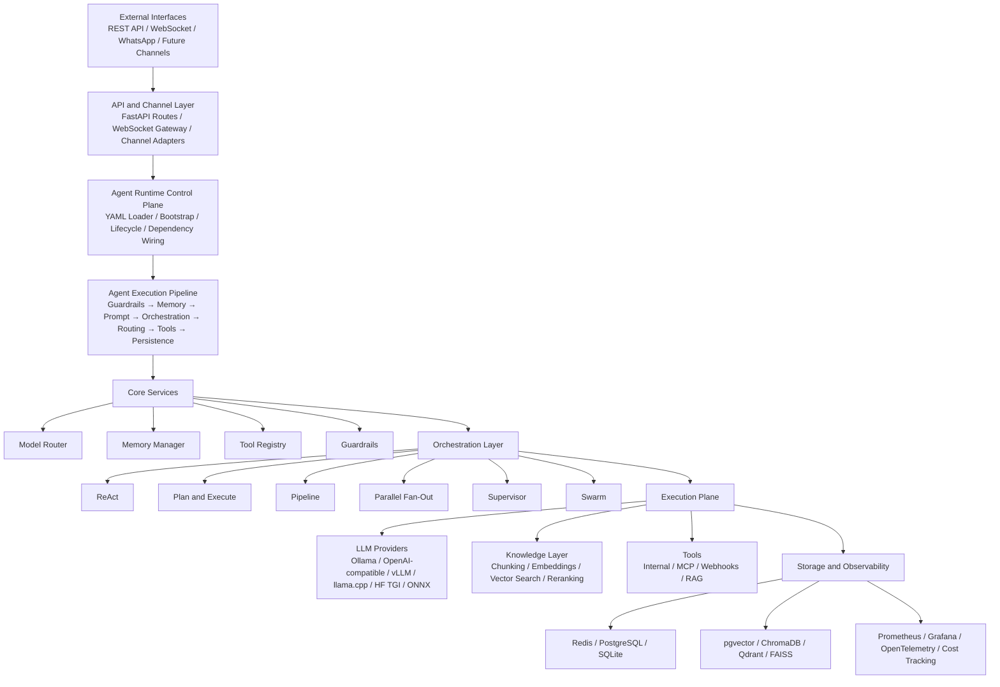

# Astromesh Architecture

This document provides the **architecture diagrams for Astromesh**, designed in a style inspired by Kubernetes‑like control plane / data plane systems.

These diagrams are intended to be embedded directly in the project README or documentation.

---

# High-Level Architecture

Astromesh is designed as an **Agent Runtime Platform** with layered architecture.

```
┌───────────────────────────────────────────────────────────────────────────────┐
│                               External Interfaces                             │
│                                                                               │
│  REST API          WebSocket API         WhatsApp Channel      Future Channels│
│  /v1/agents        /v1/ws/agent/*        Meta Cloud API         Slack/Telegram│
└───────────────────────────────────────────────────────────────────────────────┘
                                        │
                                        ▼
┌───────────────────────────────────────────────────────────────────────────────┐
│                                API / Channel Layer                            │
│                                                                               │
│  FastAPI Routes                  WebSocket Gateway         Channel Adapters   │
│  - Agents                        - Streaming tokens        - WhatsApp         │
│  - Memory                        - Live sessions           - Future adapters  │
│  - Tools                                                                      │
│  - RAG                                                                        │
└───────────────────────────────────────────────────────────────────────────────┘
                                        │
                                        ▼
┌───────────────────────────────────────────────────────────────────────────────┐
│                              Agent Runtime Control Plane                      │
│                                                                               │
│  AgentRuntime                                                                 │
│  - Load YAML definitions                                                      │
│  - Bootstrap agents                                                           │
│  - Wire dependencies                                                          │
│  - Manage lifecycle                                                           │
│                                                                               │
│  Agent Execution Pipeline                                                     │
│  Query → Guardrails → Memory → Prompt Rendering → Orchestration               │
│        → Model Routing → Tool Calls → Response → Persistence                  │
└───────────────────────────────────────────────────────────────────────────────┘
                                        │
                                        ▼
┌───────────────────────────────────────────────────────────────────────────────┐
│                                  Core Services                                │
│                                                                               │
│  Model Router        Memory Manager        Tool Registry      Guardrails      │
│  - Provider select   - Conversational      - Internal tools   - PII detect    │
│  - Fallback          - Semantic            - MCP tools        - Topic filter  │
│  - Circuit breaker   - Episodic            - Webhooks         - Cost limits   │
│  - Capability match  - Context build       - RAG as tool      - Content rules │
└───────────────────────────────────────────────────────────────────────────────┘
                                        │
                                        ▼
┌───────────────────────────────────────────────────────────────────────────────┐
│                             Orchestration / Reasoning Layer                   │
│                                                                               │
│   ReAct        Plan & Execute        Pipeline        Parallel Fan-Out         │
│   Supervisor   Swarm                                                          │
└───────────────────────────────────────────────────────────────────────────────┘
                                        │
                                        ▼
┌───────────────────────────────────────────────────────────────────────────────┐
│                                   Execution Plane                             │
│                                                                               │
│  LLM Providers                Retrieval / Knowledge           ML / Inference  │
│  - Ollama                     - Chunking                      - ONNX models   │
│  - OpenAI-compatible          - Embeddings                    - PyTorch       │
│  - vLLM                       - Vector search                 - Registries    │
│  - llama.cpp                  - Reranking                                     │
│  - HuggingFace TGI            - pgvector / Chroma / Qdrant / FAISS            │
└───────────────────────────────────────────────────────────────────────────────┘
                                        │
                                        ▼
┌───────────────────────────────────────────────────────────────────────────────┐
│                              Storage / Observability                          │
│                                                                               │
│  Redis           PostgreSQL        SQLite         Prometheus   OpenTelemetry  │
│  pgvector        ChromaDB          Qdrant         Grafana      Cost Tracking  │
└───────────────────────────────────────────────────────────────────────────────┘
```

---

# Runtime Architecture (Control Plane + Workers)

This diagram shows how the **runtime behaves similarly to distributed platforms** such as Kubernetes.

```
                                 ┌────────────────────────────┐
                                 │   Astromesh Control Plane  │
                                 │────────────────────────────│
                                 │ AgentRuntime               │
                                 │ Config Loader (YAML)       │
                                 │ Dependency Wiring          │
                                 │ Routing Policies           │
                                 │ Guardrails Policies        │
                                 │ Tool Permissions           │
                                 │ Agent Lifecycle            │
                                 └──────────────┬─────────────┘
                                                │
                         ┌──────────────────────┼──────────────────────┐
                         │                      │                      │
                         ▼                      ▼                      ▼
             ┌──────────────────┐   ┌──────────────────┐   ┌──────────────────┐
             │  Agent Worker A  │   │  Agent Worker B  │   │  Agent Worker C  │
             │──────────────────│   │──────────────────│   │──────────────────│
             │ ReAct            │   │ Plan & Execute   │   │ Supervisor/Swarm │
             │ Tool Calls       │   │ Memory Access    │   │ Multi-Agent Flow │
             │ Prompt Rendering │   │ Model Routing    │   │ Delegation       │
             └────────┬─────────┘   └────────┬─────────┘   └────────┬─────────┘
                      │                      │                      │
                      └──────────────┬───────┴──────────────┬───────┘
                                     │                      │
                                     ▼                      ▼
                     ┌──────────────────────────┐   ┌──────────────────────────┐
                     │     Model Execution      │   │     Tool / Knowledge     │
                     │──────────────────────────│   │──────────────────────────│
                     │ Ollama                   │   │ Internal Python tools    │
                     │ OpenAI-compatible APIs   │   │ MCP tools                │
                     │ vLLM                     │   │ Webhooks                 │
                     │ llama.cpp                │   │ RAG pipelines            │
                     │ HuggingFace TGI          │   │ Vector retrieval         │
                     │ ONNX Runtime             │   │ Reranking                │
                     └──────────────┬───────────┘   └──────────────┬───────────┘
                                    │                              │
                                    └──────────────┬───────────────┘
                                                   │
                                                   ▼
                              ┌──────────────────────────────────────┐
                              │     State / Storage / Telemetry      │
                              │──────────────────────────────────────│
                              │ Redis                                │
                              │ PostgreSQL / SQLite                  │
                              │ pgvector / ChromaDB / Qdrant / FAISS │
                              │ OpenTelemetry / Prometheus / Grafana │
                              │ Cost Tracking                        │
                              └──────────────────────────────────────┘
```

---

# Mermaid Architecture Diagram

GitHub supports Mermaid diagrams natively.




---

# Why This Architecture

This architecture separates **agent control**, **reasoning orchestration**, and **execution infrastructure** into distinct layers.

Benefits include:

- Declarative agent definitions
- Swappable LLM providers
- Pluggable memory backends
- Multi-agent orchestration
- Built-in observability
- Channel integrations
- Safe tool execution

This design allows Astromesh to scale from **single-agent applications to distributed agentic systems**.