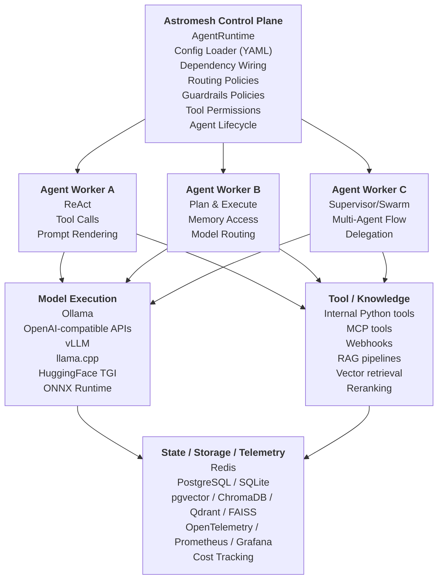
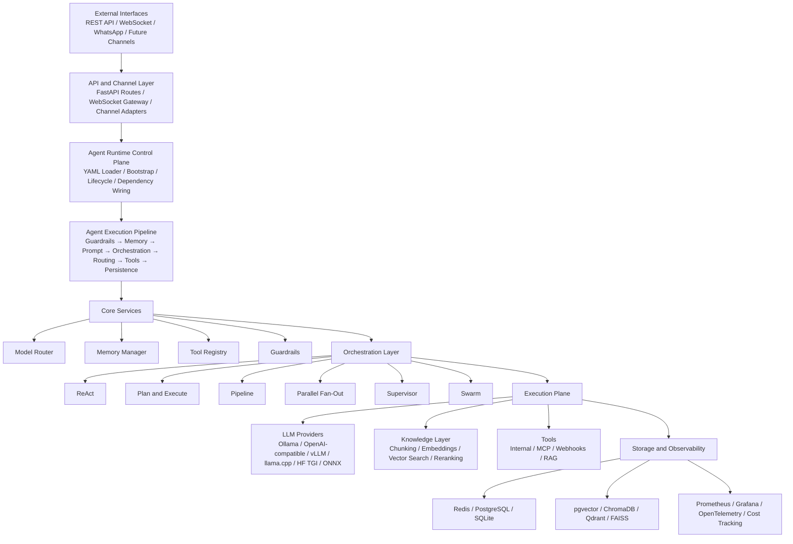

# Astromesh Architecture

This document provides the **architecture diagrams for Astromesh**, designed in a style inspired by Kubernetes‑like control plane / data plane systems.

These diagrams are intended to be embedded directly in the project README or documentation.

---

# High-Level Architecture

Astromesh is designed as an **Agent Runtime Platform** with layered architecture.

```mermaid
flowchart TB
    ext["`**External Interfaces**
    REST API /v1/agents
    WebSocket API /v1/ws/agent/*
    WhatsApp Channel Meta Cloud API
    Future Channels Slack/Telegram`"]
    api["`**API / Channel Layer**
    FastAPI Routes: Agents, Memory, Tools, RAG
    WebSocket Gateway: Streaming tokens, Live sessions
    Channel Adapters: WhatsApp, Future adapters`"]
    cp["`**Agent Runtime Control Plane**
    AgentRuntime: Load YAML definitions, Bootstrap agents, Wire dependencies, Manage lifecycle
    Agent Execution Pipeline: Query → Guardrails → Memory → Prompt Rendering → Orchestration → Model Routing → Tool Calls → Response → Persistence`"]
    core["`**Core Services**
    Model Router: Provider select, Fallback, Circuit breaker, Capability match
    Memory Manager: Conversational, Semantic, Episodic, Context build
    Tool Registry: Internal tools, MCP tools, Webhooks, RAG as tool
    Guardrails: PII detect, Topic filter, Cost limits, Content rules`"]
    orch["`**Orchestration / Reasoning Layer**
    ReAct, Plan & Execute, Pipeline, Parallel Fan-Out, Supervisor, Swarm`"]
    plane["`**Execution Plane**
    LLM Providers: Ollama, OpenAI-compatible, vLLM, llama.cpp, HuggingFace TGI
    Retrieval / Knowledge: Chunking, Embeddings, Vector search, Reranking, pgvector / Chroma / Qdrant / FAISS
    ML / Inference: ONNX models, PyTorch, Registries`"]
    store["`**Storage / Observability**
    Redis, PostgreSQL, SQLite, Prometheus, OpenTelemetry
    pgvector, ChromaDB, Qdrant, Grafana, Cost Tracking`"]
    ext --> api --> cp --> core --> orch --> plane --> store
```

---

# Runtime Architecture (Control Plane + Workers)

This diagram shows how the **runtime behaves similarly to distributed platforms** such as Kubernetes.

---

# Mermaid Architecture Diagram

GitHub supports Mermaid diagrams natively.

---

# Why This Architecture

This architecture separates **agent control**, **reasoning orchestration**, and **execution infrastructure** into distinct layers.

Benefits include:

- Declarative agent definitions
- Swappable LLM providers
- Pluggable memory backends
- Multi-agent orchestration
- Built-in observability
- Channel integrations
- Safe tool execution

This design allows Astromesh to scale from **single-agent applications to distributed agentic systems**.