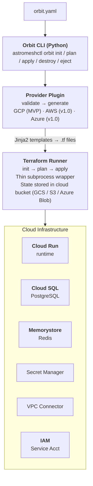
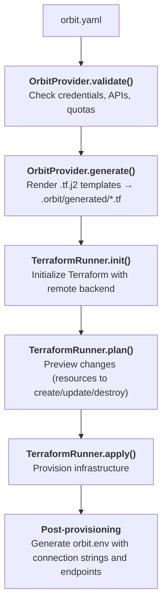

# Astromesh Orbit — Developer Overview

Astromesh Orbit is a standalone deployment tool that provisions the full Astromesh stack on cloud infrastructure with a single command. It generates Terraform HCL from Jinja2 templates, using a provider plugin architecture that makes multi-cloud support a matter of implementing a new provider.

**Target audience:** Teams that want production-ready Astromesh infrastructure on managed cloud services without writing Terraform by hand.

---

## Architecture

Orbit sits between your `orbit.yaml` configuration and Terraform. It validates cloud prerequisites, renders provider-specific `.tf` files from templates, and delegates all resource management to Terraform.



---

## Core Design Principles

### Terraform Generation, Not Abstraction

Orbit is not a Terraform wrapper that hides what happens. It generates plain `.tf` files from Jinja2 templates. You can inspect the generated output in `.orbit/generated/`, and you can `eject` at any time to get standalone Terraform files with no Orbit dependency.

### Provider Plugin Architecture

Each cloud provider implements the `OrbitProvider` Protocol — a runtime-checkable interface (following the same convention as `ProviderProtocol` in the core Astromesh runtime). The protocol defines six operations:

| Method | Purpose |
|---|---|
| `validate()` | Check credentials, permissions, enabled APIs, quotas |
| `generate()` | Render Jinja2 templates into `.tf` files |
| `provision()` | validate + generate + terraform apply |
| `status()` | Read Terraform state and report resource status |
| `destroy()` | terraform destroy + cleanup |
| `eject()` | Generate standalone `.tf` files (no Jinja2, no Orbit dependency) |

Adding a new cloud is implementing this protocol and writing the corresponding `.tf.j2` templates.

### Cloud-Native by Default

Orbit maps Astromesh services to each cloud's managed equivalents instead of self-hosting:

| Astromesh Component | GCP (MVP) | AWS (v1.0) | Azure (v1.0) |
|---|---|---|---|
| Compute | Cloud Run | ECS / Fargate | Container Apps |
| Database | Cloud SQL (PostgreSQL) | RDS | Azure Database |
| Cache | Memorystore (Redis) | ElastiCache | Azure Cache |
| Secrets | Secret Manager | Secrets Manager | Key Vault |
| State storage | GCS | S3 + DynamoDB | Azure Blob |

---

## What Gets Deployed

On GCP (MVP), `orbit apply` provisions the following resources:

| Resource | Template | Purpose |
|---|---|---|
| 1 Cloud Run service | `cloud_run.tf.j2` | Runtime |
| Cloud SQL for PostgreSQL | `cloud_sql.tf.j2` | Database for the runtime |
| Memorystore for Redis | `memorystore.tf.j2` | Cache and memory backend |
| Secret Manager entries | `secrets.tf.j2` | Provider keys, JWT secret |
| Serverless VPC Connector | `networking.tf.j2` | Private network access for Cloud Run |
| Service Account + IAM | `iam.tf.j2` | Least-privilege identity |
| GCS Bucket | `backend.tf.j2` | Terraform remote state |
| GCS Bucket (RAG docs) | `storage.tf.j2` | Source documents for RAG (optional) |
| Artifact Registry | `artifact_registry.tf.j2` | Docker repo for custom images (optional) |

Automatic resources (VPC Connector, Service Account, IAM bindings) are provisioned without user configuration. Cloud Run connects to Cloud SQL via the built-in Auth Proxy sidecar — no public database IP is exposed.

---

### RAG Vector Store

Orbit does not provision a separate vector database. Astromesh's `PGVectorStore` enables the
`vector` extension on first use, and Cloud SQL for PostgreSQL supports pgvector natively —
so the vector store is the Cloud SQL instance Orbit already deploys. Point a RAG pipeline at
it with `vector_store.backend: pgvector` in a `*.rag.yaml` (the runtime already mounts the
Cloud SQL socket at `/cloudsql` and receives `ASTROMESH_DATABASE_URL`).

The `${project}-<name>-rag-docs` bucket stages source documents; the runtime receives its
name as `ASTROMESH_RAG_BUCKET`.

---

## Multi-Cloud Vision

The MVP ships with GCP only. AWS and Azure providers are planned for v1.0. The provider plugin architecture means:

- Core Orbit code (CLI, config parsing, Terraform runner) is cloud-agnostic
- Each provider is an optional dependency (`pip install astromesh-orbit[gcp]`)
- Templates live under `providers/{cloud}/templates/`
- No core code changes needed to add a provider

---

## Subproject Structure

Orbit lives in `astromesh-orbit/` at the repository root — a standalone Python package with no dependency on the core `astromesh` runtime:

```
astromesh-orbit/
├── pyproject.toml              # astromesh-orbit[gcp,aws,azure]
├── astromesh_orbit/
│   ├── cli.py                  # Registers as astromeshctl plugin
│   ├── config.py               # OrbitConfig — parses orbit.yaml
│   ├── core/
│   │   ├── provider.py         # OrbitProvider Protocol
│   │   ├── state.py            # Reads terraform.tfstate from bucket
│   │   └── resources.py        # Typed dataclasses (ComputeSpec, DatabaseSpec, CacheSpec)
│   ├── terraform/
│   │   ├── runner.py           # Subprocess wrapper: init, plan, apply, destroy, output
│   │   └── backend.py          # Remote state configuration (GCS, S3, Azure Blob)
│   ├── wizard/
│   │   ├── interactive.py      # Interactive wizard (typer/rich prompts)
│   │   └── defaults.py         # Preset defaults (starter, pro)
│   └── providers/
│       └── gcp/
│           ├── provider.py     # GCPProvider(OrbitProvider)
│           ├── validators.py   # Project, permissions, API checks
│           └── templates/      # 10 Jinja2 .tf.j2 files
└── tests/
```

---

## CLI Commands

Orbit registers as an `astromeshctl` plugin via Python entry points:

```
astromeshctl orbit init      Interactive wizard — generates orbit.yaml
astromeshctl orbit plan      Validate + generate .tf + terraform plan (preview)
astromeshctl orbit apply     Full provisioning — validate + generate + terraform apply
astromeshctl orbit status    Read Terraform state and show resource status
astromeshctl orbit destroy   Tear down all provisioned resources
astromeshctl orbit eject     Export standalone Terraform files (no Orbit dependency)
```

---

## Execution Flow



---

## State Management

Terraform state is stored remotely in a cloud bucket owned by the user:

- **GCP:** GCS bucket `{project}-astromesh-orbit-state` with versioning enabled
- **AWS (future):** S3 bucket with DynamoDB locking
- **Azure (future):** Azure Blob with lease locking

The state bucket is the only resource created via cloud SDK directly (before Terraform can initialize). Key behaviors:

- If the bucket does not exist, Orbit creates it with versioning enabled
- If the bucket already exists, it is reused
- If the bucket name is taken by another project, Orbit appends a 6-char hash suffix
- `orbit destroy` does NOT delete the state bucket (it contains the state needed to verify teardown)

---

## Working Directory

```
.orbit/                     # Gitignored — orbit init adds it to .gitignore
  generated/                # .tf files rendered from templates
  orbit.env                 # Connection variables after deploy
  .terraform/               # Terraform cache
```

Only `orbit.yaml` is committed to git. Everything under `.orbit/` is generated and gitignored.

---

## Wizard Presets

The interactive wizard (`orbit init`) offers two presets:

| Preset | Estimated Cost | Compute | Database | Cache |
|---|---|---|---|---|
| **Starter** | ~$15/mo | 1 instance each, 1 CPU / 1Gi | db-f1-micro, no HA | 1 GB basic |
| **Pro** | ~$80/mo | Auto-scaling 1-5, 2 CPU / 2Gi | db-g1-small with HA | 4 GB standard |

The wizard writes explicit values to `orbit.yaml` — no magic tier references at runtime. You can edit the file after generation.

---

## Error Handling

| Scenario | Behavior |
|---|---|
| `terraform apply` fails mid-way | Terraform handles partial state. Orbit shows what was created and what failed. Re-run `orbit apply` (idempotent) or `orbit destroy` to clean up. |
| Validation failure | Runs before any Terraform operation. Clear error messages with remediation commands. |
| Missing Terraform binary | Detected at `orbit init`. Shows installation instructions. |
| Missing cloud credentials | Detected at `validate()`. Shows `gcloud auth login` instructions. |

---

## Service Roadmap

### v0.1.0 — Core (MVP)

- Cloud Run (runtime)
- Cloud SQL for PostgreSQL
- Memorystore for Redis
- Secret Manager
- VPC Connector + IAM
- Terraform state in GCS
- CLI: init, plan, apply, status, destroy, eject
- Interactive wizard with presets

### v0.2.0 — Observability

- Cloud Monitoring, Trace, and Logging
- Pre-configured dashboard
- `orbit logs` and `orbit upgrade` CLI commands

### v0.3.0 — Storage & RAG  ✅

- Cloud Storage bucket for RAG documents (wired to the runtime via `ASTROMESH_RAG_BUCKET`)
- Artifact Registry for custom images
- pgvector on the existing Cloud SQL as the RAG vector store (no separate vector DB)
- ~~Cloud CDN for Studio~~ — dropped; Studio is no longer deployed (see commit 6278ccc)

### v0.4.0 — GPU & Inference

- Cloud Run with GPU (vLLM)
- Embeddings and reranker services

### v0.5.0 — Enterprise

- Cloud Armor (WAF)
- Custom domains + managed SSL
- Native VPC, Cloud DNS

### v1.0.0 — Multi-Cloud

- AWS provider (ECS/Fargate + RDS + ElastiCache)
- Azure provider (Container Apps + Azure DB + Azure Cache)
- GCP, AWS, and Azure Marketplace listings

---

## Dependencies

Orbit is a standalone package with minimal dependencies:

| Dependency | Purpose |
|---|---|
| `jinja2` | Template rendering |
| `pyyaml` | Config parsing |
| `pydantic` | Config validation |
| `rich` | Terminal output |
| `typer` | CLI framework |
| `google-cloud-resource-manager` (optional, GCP) | Pre-deploy validation |
| `google-auth` (optional, GCP) | Authentication checks |

Terraform is a required external binary, not a Python dependency. It is validated at runtime.

---

## Related Docs

- **Quick Start:** [`ORBIT_QUICKSTART.md`](ORBIT_QUICKSTART.md)
- **Configuration Reference:** [`ORBIT_CONFIGURATION.md`](ORBIT_CONFIGURATION.md)
- **Design Spec:** [`superpowers/specs/2026-03-18-astromesh-orbit-design.md`](superpowers/specs/2026-03-18-astromesh-orbit-design.md)
